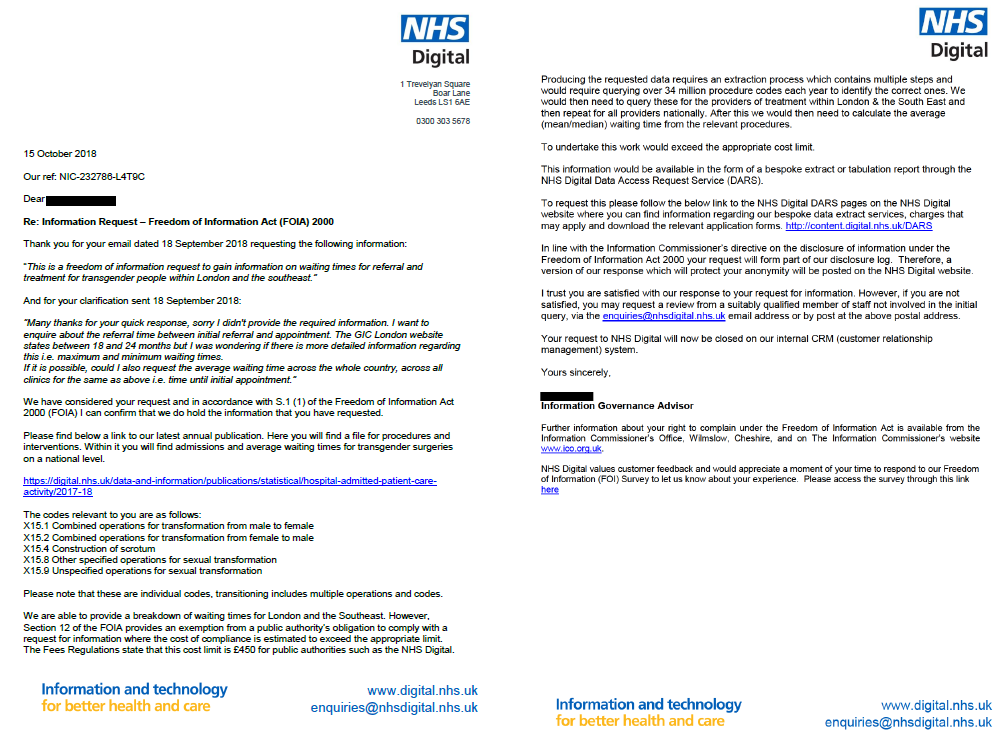

```{css, echo=FALSE}

.main-container {
  max-width: 1400px;
  margin-left: auto;
  margin-right: auto;
}

blockquote{
  padding: .75em .5em .75em 1em;
  background: white;
  border-left: 0.5em solid;
}

.container-fluid.main-container{
max-width: 85%
}

.centerplot {
  display: table;
  margin-right: auto;
  margin-left: auto;
  width:50%;
}

.refclass {
  font-size: 12px;
}

h1.refclass{
  font-size: 12px;
}

.div-1 {
        color: #EBEBEB;
        font-size: 12pt;
        text-align: left;
}

.div-2 {
  color: black;
  font-size: 12pt;
  text-align: center;
}


.div-3 {
  color: black;
  font-size: 12pt;
  text-align: left;
}


.rellink {
  font-size:16pt;
  text-align:center;
  font-weight:bold;
}

.codebox {
  font-size:12pt;
  border: 1px solid #626262;
  width:50%;
  background-color: #fff5e2;
  margin: auto;
  padding: 10px;
}

.methodbox {
  font-size:12pt;
  border: 1px solid #d2d2d2;
  width:90%;
  background-color: #f6f6f6;
  margin: auto;
  padding: 10px;
}

.summarybox {
  font-size:12pt;
  border: 1px solid #d2d2d2;
  width:90%;
  background-color: #e1edfa;
  margin: auto;
  padding: 10px;
}

.title {
  text-align:center;
}

.tt { 
  background-color: #fff5e2;
}

/* Whole document: */
body{
  font-size: 12pt;
  margin-bottom: 15px; /* between paragraphs */
}
/* Headers */
h1 {
  font-size: 24pt;
  text-align: center;
}

h3 {
  
  font-size: 20pt;
  text-align: center;

}

h2,h4,h5,h6{
  font-size: 20pt;
}


/* Style the tab */
.tabone,
.tabtwo,
.tabthree {
  overflow: hidden;
  border: 1px solid #ccc;
  border-bottom: none;
  background-color: inherit;
}


/* Style the buttons that are used to open the tab content */
.tab button {
  background-color: inherit;
  float: left;
  border: none;
  outline: none;
  cursor: pointer;
  padding: 14px 16px;
  transition: 0.3s;
}

/* Change background color of buttons on hover */
.tab button:hover {
  background-color: #ddd;
}

/* Create an active/current tablink class */
.tab button.active {
  background-color: #ccc;
}

.tablink {
  background-color: #cbcbcb;
  color: black;
  font-weight: bold;
  float: left;
  border: none;
  outline: none;
  cursor: pointer;
  padding: 14px 16px;
  font-size: 17px;
  width: 33.3333%;
}

.tablinktwo,
.tablinkthree {
  background-color: #cbcbcb;
  font-weight: bold;
  color: black;
  float: left;
  border: none;
  outline: none;
  cursor: pointer;
  padding: 14px 16px;
  font-size: 17px;
  width: 25%;
}


.tablink:hover {
  background-color: #d8d8d8;
}

/* Style the tab content (and add height:100% for full page content) */
.tabcontentone,
.tabcontenttwo,
.tabcontentthree {
  color: black;
  display:none;
  height:100%;
  border: 1px solid #ccc;
  border-top: none;
  padding: 40px 20px;
}

#procedures {background-color: #e6e6e6;}
#diagnoses {background-color: #e6e6e6;}
#linking {background-color: #e6e6e6;}
#speculative {background-color: #e6e6e6;}

#waitingtime {background-color:#f1f1f1;}
#admissions {background-color:#f1f1f1;}
#daycases {background-color:#f1f1f1;}
#staylength {background-color:#f1f1f1;}

#waitingtimeD {background-color:#f1f1f1;}
#admissionsD {background-color:#f1f1f1;}
#daycasesD {background-color:#f1f1f1;}
#staylengthD {background-color:#f1f1f1;}


```

<div class="div-2">
Nicholas Lange<br>
[Email](mailto:lange.nk@gmail.com) | [Github](https://github.com/nklange/TransHealthProcedures)<br></div>
<div class="div-3">
Last updated: `r format(Sys.time(), '%B %d %Y')`
</div>


```{r code,echo=FALSE,message=FALSE,error=FALSE,warning=FALSE}

library(stringr)
library(dplyr)
library(tidyr)
library(magrittr)
library(purrr)
library(readr)
library(tibble)
library(ggplot2)
#library(ggpattern)
library(cowplot)
library(plotly)

footnote <- function(codes) { 
  
  c(codes,paste0("‡ ",codes),paste0("‡",codes))
    
    }


facet_strip_bigger <- function(gp, size){
  if(missing(gp)){
    print("this function needs a facet_wrap ggplotly object")
  }
  if(missing(size)){
    print("this function needs 'size' argument to be specified as integer. 80 will be introduced as default")
    size <- 80
  }
  
  n_facets <- c(1:length(gp[["x"]][["layout"]][["shapes"]]))
  
  for(i in n_facets){
    if(n_facets[i] %% 2 == 0){
      gp[["x"]][["layout"]][["shapes"]][[i]][["y0"]] <- + as.numeric(size)
      gp[["x"]][["layout"]][["shapes"]][[i]][["y1"]] <- 0
    }
  }
  
  return(gp)
}

#OSPC4
transproc <- c("X15.1","X15.2","X15.4","X15.8","X15.9")
procedurecodes <- footnote(transproc)

mastectomyproc <-c("B27.4","B27.5","B27.6")
phalloplastyproc <- "N28.1"
hysterproc <- c("Q07.3","Q07.4","Q07.5","Q07.8","Q07.9",
                "Q08.3","Q08.8","Q08.9",
                "Q22.1","Q22.2","Q22.3",
                "Q24.1","Q24.2","Q24.3")
orchidectomyproc <- c("N05.1","N05.2","N05.3","N05.8","N06.3")
penectomyproc <-  c("N26.1","N26.2","N26.8","N26.9")
vagplasty <- c("P21.2","P21.3","P21.5")
oocyte <- c("Q48.1","Q48.2","Q48.3","Q48.4","Q48.8","Q48.9")

sperm <- c("N34.1","N34.2","N34.4","N34.5","N34.6","N34.8")


altcodes <- footnote(c(mastectomyproc,phalloplastyproc,hysterproc,orchidectomyproc,penectomyproc,
                       vagplasty,oocyte,sperm))


#ICD10
transdiag <- c("F64.0","F64.1","F64.2","F64.8","F64.9")

CollectedData <- readRDS("ProcessedData/ProceduresDiag.rds")
relevantcol <- c("year","type","Code","Description","FinEpisodes","Admissions",
                 "GenderMale","GenderFemale","GenderUnknown",
                 "MeanWaiting","MedianWaiting","MeanStay","MedianStay")
yearlabels <- stringr::str_replace_all(unique(CollectedData$year),"to","-")
diaglabels <- c("F64.0","F64.1","F64.2","F64.8","F64.9")
  
```


```{r, echo=FALSE,warning=FALSE}

library(tippy)
tippy::tippy_this(elementId = "X15Codes", arrow="true", tooltip = "
                  <div class='div-1'>Procedure code X15 (OPCS-4):
                  <ul>
                  <li>X15.1 Combined operations for transformation from male to female</li>
                  <li>X15.2 Combined operations for transformation from female to male</li>
                  <li>X15.4 Construction of scrotum</li>
                  <li>X15.8 Other specified operations for sexual transformation</li>
                  <li>X15.9 Unspecified operations for sexual transformation</li>
                  </ul>
                  </div>")

tippy::tippy_this(elementId = "F64Codes", arrow="true", tooltip = "
                  <div class='div-1'>Diagnosis Code F64 (ICD-10):
                  <ul>
                  <li>F64.0	Transsexualism
                  <li>F64.1 Dual role transvestism
                  <li>F64.2	Gender identity disorder of childhood
                  <li>F64.8	Other gender identity disorders
                  <li>F64.9 Gender identity disorder, unspecified
                  </ul>
                  </div>")

tippy::tippy_this(elementId = "F64.0", arrow="true", tooltip = "<div class='div-1'>Diagnosis: F64.0	Transsexualism</div>")
tippy::tippy_this(elementId = "F64.1", arrow="true", tooltip = "<div class='div-1'>Diagnosis: F64.1 Dual role transvestism</div>")
tippy::tippy_this(elementId = "F64.2", arrow="true", tooltip = "<div class='div-1'>Diagnosis: F64.2	Gender identity disorder of childhood</div>")
tippy::tippy_this(elementId = "F64.8", arrow="true", tooltip = "<div class='div-1'>Diagnosis: F64.8 Other gender identity disorders</div>")
tippy::tippy_this(elementId = "F64.9", arrow="true", tooltip = "<div class='div-1'>Diagnosis: F64.9 Gender identity disorder, unspecified</div>")
```


<div class="summarybox"><p>
Transgender health care is frequently discussed in terms of waiting times for gender identity clinics as the first step of accessing further treatment, such as hormone or surgical interventions, on the NHS. Information about the prevalence of gender confirmation surgeries on the NHS is less publicised but available to the general public as part of the aggregate hospital episode statistics.</p>

<p>In the NHS coding of procedures and interventions associated with hospital episodes, a group of procedure codes (X15) indicates procedures and interventions for gender confirmation. Cross-referencing aggregate hospital episodes for these procedures with diagnoses that relate to gender confirmation (ICD F64 codes) suggests that, in actual fact, procedures for gender confirmation are often not coded as X15. It is likely - though speculative - that these procedures are subsumed under codes that are used to code these surgeries when they are not sought for gender-confirmation. While this may be a welcome sentiment, it will lead to grossly wrong inferences about the prevalence of surgeries for gender confirmation, or associated characteristics like waiting times, if these statistics are taken at face value. As "[t]he purpose of [these published statistics] is to inform and support strategic and policy-led processes for the benefit of patient care"[@HAPCA_2021], this is concerning.</p></div>

# Background {-}

Recently, the state of transgender health care in the UK under the NHS has received media attention. The focus of this attention is most acutely on the waiting lists to access a first appointment at one of the gender identity clinics (GICs) in the UK as the first step on the gender-confirmation pathway on the NHS [@Parsons_NHS_2020;@BBC_transgender_2021]. Some gender clinics now openly share their waiting list, such as the Gender Identity Clinic (formerly Charing Cross, now Tavistock and Portman) publishing that individuals being seen now (most recent available: January 2022) were referred in December 2017 [@GIC_waiting_2021]. The information about waiting lists for other gender clinics have similarly been made public by the trans community by word-of-mouth or as responses to Freedom-of-Information requests[@THUK_waiting_2021]. The availability of this information can and does inform public opinion and policy.

Accessing an initial appointment at a GIC is the pre-requisite first step to access further treatment and interventions on the NHS. While not all individuals being seen at a gender clinic follow the same pathway, many will seek hormones and surgical interventions. According to the NHS, the surgeries that are common and routinely available for gender-confirmation on the NHS are[@NHS_gender_nd]: 

* bilateral mastectomy and associated chest reconstruction (incl., if necessary, nipple repositioning, dermal implants and tattoos)
* phalloplasty and metoidoplasty (construction of a penis, incl., if necessary, penile implants)
* scrotoplasty (construction of a scrotum) and testicular implants
* removal of the womb and/or ovaries and fallopian tubes (hysterectomy and/or salpingo-oophorectomy)

* removal of testes (orchidectomy)
* removal of penis (penectomy)
* construction of vagina (vaginoplasty), vulva (vulvoplasty) and clitoris (clitoroplasty)

While other surgeries are possible and offered in the private sector (such as facial feminising surgery), these are not routinely offered by the NHS. Not all transgender or gender non-conforming individuals seek all (or any) of the possible surgeries available to them, and individual preferences determine the details and extent of each surgery. Generally, referrals for these surgeries will be made by GICs for the individual when they are still under the care of a GIC at the time -- or by an individual's GP if they have already been discharged from a GIC.

While the number of individuals looking to access a GIC, and the associated length of the waiting list for initial treatment, are well-documented, the prevalence and ease of accessing treatment at a later stage of the pathway is not. In 2018, a Freedom-of-Information-Act (FOIA) request (Figure \@ref(fig:foia)) sent to the NHS, and subsequently published on NHS Digital [@NHSDigital_FOIA_2018], asked for information about the waiting time from referral to initial appointment for transgender people.

&nbsp;
```{r foia, fig.cap = "Response to Freedom-of-Information-Act request about waiting times for transgender procedures in 2018",out.width='100%', echo=FALSE}

```
&nbsp;

While the FOIA request specifically enquired about the waiting lists for an appointment at the GICs, rather than about further care, the response offered by NHS Digital references the "admissions and average waiting times for transgender surgeries on a national level" and referred the requestant to the "Procedures and Interventions" document published annually by NHS Digital as part of the "Hospital Admitted Patient Care Activity" report [@HAPCA]. In these documents, hospital episodes are aggregated across procedure codes, and across diagnoses separately. As stated in the introduction of these statistics, "[t]he purpose of [these published statistics] is to inform and support strategic and policy-led processes for the benefit of patient care. This document will also be of interest to researchers, journalists and members of the public interested in NHS hospital activity in England" [@HAPCA_2021].

Throughout I use the information in these documents to aggregate the information available about hospital care accessed by transgender individuals for the purpose of gender confirmation. The aim of this analysis is to gain an understanding of the prevalence of surgical gender-confirmation treatment accessed by individuals in the NHS, and the associated characteristics, such as waiting times, of these treatments.

# Data {-}

For the analyses here, I downloaded the "Hospital Episode Statistics for England. Admitted Patient Care statistics: Procedures and Interventions" and "Hospital Episode Statistics for England. Admitted Patient Care statistics: Diagnoses" published by NHS Digital [@HAPCA]. These code finished consultant episodes (FCEs) at a hospital aggregated for a particular procedure code and a particular diagnosis respectively. There are procedure and diagnosis codes that are specific to gender confirmation and gender identity: X15 procedure codes in the NHS coding (OPCS) and F64 diagnoses (ICD). The information in these statistics, i.e., as the number of episodes and associated characteristics, is already aggregated across individual episodes. As this means that procedures and diagnoses cannot be cross-referenced directly, I discuss both separately initially. A more detailed description of the data processing approach is at the bottom of the page, processed data underlying the plots are downloadable as [.csv files](https://github.com/nklange/TransHealthProcedures/tree/main/PlotData). 

&nbsp;

<div class="tabtwo">
  <button class="tablink" onclick="openPage('procedures',this,'#e6e6e6')" id="defaultOpen">Procedures</button>
  <button class="tablink" onclick="openPage('diagnoses',this,'#e6e6e6')" id="diagnosistab">Diagnoses</button>
  <button class="tablink" onclick="openPage('linking',this,'#e6e6e6')">Linking procedures and diagnoses</button>
</div>

<div id="procedures" class="tabcontenttwo">

```{r code2,echo=FALSE,message=FALSE,error=FALSE,warning=FALSE}


totalproc <- CollectedData %>% filter(type=="Procedures") %>% 
  select(relevantcol) %>% 
  select(c("year","type","Code","Description","FinEpisodes",
           "GenderMale","GenderFemale","GenderUnknown")) %>% 
  mutate(across(c("FinEpisodes","GenderMale","GenderFemale","GenderUnknown"),as.numeric)) %>% 
  replace_na(list(GenderFemale=0,GenderUnknown=0)) %>% 
  mutate(NotProvided = FinEpisodes - GenderMale - GenderFemale -GenderUnknown) %>% 
  
  pivot_longer(cols=c("GenderMale","GenderFemale","GenderUnknown","NotProvided"),names_to="gender",values_to="value") %>% 
  group_by(year,gender) %>% 
  mutate(value = as.numeric(value),
         FinEpisodes = as.numeric(FinEpisodes)) %>% 
  summarize(totalep = sum(FinEpisodes,na.rm=T),
            sumvalue = sum(value,na.rm=T)) %>% 
  mutate(gender= factor(gender,levels=rev(c("GenderMale","GenderUnknown","GenderFemale","NotProvided")),
                        labels=rev(c("Male","Unknown","Female","N/A"))))

totalproc2 <- CollectedData %>% filter(type=="Procedures") %>% 
  select(relevantcol) %>% 
  select(c("year","type","Code","Description","FinEpisodes",
           "GenderMale","GenderFemale","GenderUnknown")) %>% 
 
  group_by(year,Code) %>% 
  mutate(FinEpisodes = as.numeric(FinEpisodes)) %>% 
  group_by(year) %>% 
  mutate(percentage = (FinEpisodes/sum(FinEpisodes))*100)  %>% 
  mutate(Code= factor(Code,levels=c("X15.9","X15.1","X15.8","X15.2"),
                        labels=c("X15.9","X15.1","X15.8","X15.2")))


totalprocplot <- totalproc %>% 
  rename("number" = sumvalue) %>% 
  group_by(year) %>% 
  mutate(percentage = (number/sum(number))*100)


proc<-ggplot(totalprocplot, aes(x = number, y= year, fill = gender,
                            text=paste0(gender,"\n", number," (", round(percentage,1),"%)"))) + 
  # geom_bar(data=totaldiag %>% filter(gender=="Male"), aes(x=totalep,y=year),
  #          fill="grey",color="black",stat="identity")+
  geom_bar(stat="identity",color="transparent")+
 # geom_text(size = 3, position = position_stack(vjust = 0.5))+
  
  # geom_bar(data=totaldiag %>% filter(gender=="Male"), aes(x=totalep,y=year),
  #          fill="transparent",color="black",stat="identity")+

  scale_y_discrete(labels = yearlabels,name="Period")+
  scale_x_continuous(name="Finished Consultant Episodes")+
 #coord_flip() + 
  scale_fill_manual(name="Gender Marker",values=c("#FC8D62","#E78AC3","#66C2A5","#8DA0CB")) + 
  theme_bw()+
  theme(axis.text.x= element_text(size=12,angle=90,hjust=1,vjust=0.5),
        plot.background = element_rect(fill = "transparent",color="transparent"),
        
        axis.text.y= element_text(size=12),
        axis.title= element_text(size=12),
        axis.title.y = element_blank(),
        strip.text = element_text(size=12),
        strip.background = element_rect(color="transparent",fill="transparent"),
        legend.title  = element_text(size=12))


proc2 <- ggplot(totalproc2, aes(x = FinEpisodes, y= year, fill = Code,
                            text=paste0(Code,"\n", FinEpisodes," (", round(percentage,1),"%)"))) + 
  # geom_bar(data=totaldiag %>% filter(gender=="Male"), aes(x=totalep,y=year),
  #          fill="grey",color="black",stat="identity")+
  geom_bar(stat="identity",color="transparent")+
 # geom_text(size = 3, position = position_stack(vjust = 0.5))+
  
  # geom_bar(data=totaldiag %>% filter(gender=="Male"), aes(x=totalep,y=year),
  #          fill="transparent",color="black",stat="identity")+

  scale_y_discrete(labels = yearlabels,name="Period")+
  scale_x_continuous(name="Finished Consultant Episodes")+
 #coord_flip() + 
  scale_fill_manual(name="X15 code",values=c("#FC8D62","#E78AC3","#66C2A5","#8DA0CB")) + 
  theme_bw()+
  theme(axis.text.x= element_text(size=12,angle=90,hjust=1,vjust=0.5),
        plot.background = element_rect(fill = "transparent",color="transparent"),
        
        axis.text.y= element_text(size=12),
        axis.title= element_text(size=12),
        axis.title.y = element_blank(),
        strip.text = element_text(size=12),
        strip.background = element_rect(color="transparent",fill="transparent"),
        legend.title  = element_text(size=12))

proc1_plotly <- ggplotly(proc, tooltip = c("text")) %>%
  layout(margin = list(t = 110),
         legend=list(itemclick = "toggleothers",
                     bgcolor="white",
                     bordercolor="grey",
                     y = 0.5,
                     title = list(font = list(size=14)),
                     font = list(size=12)),
         hovermode = "closest") %>% 
  facet_strip_bigger(20)

proc2_plotly <- ggplotly(proc2, tooltip = c("text")) %>%
  layout(margin = list(t = 110),
         legend=list(itemclick = "toggleothers",
                     bgcolor="white",
                     bordercolor="grey",
                     y = 0.5,
                     title = list(font = list(size=14)),
                     font = list(size=12)),
         hovermode = "closest") %>% 
  facet_strip_bigger(20)


proclabels <- c("X15.1\nMale to female",
                "X15.2\nFemale to male",
                "X15.4\nScrotum",
                "X15.8\nOther",
                "X15.9\nUnspecified")

totalprocbytype <- CollectedData %>% filter(type=="Procedures") %>% 
  select(relevantcol) %>% 
  
  mutate(across(c("FinEpisodes","GenderMale","GenderFemale","GenderUnknown","MedianWaiting"),as.numeric)) %>% 
  replace_na(list(GenderFemale=0,GenderUnknown=0)) %>% 
  mutate(NotProvided = FinEpisodes - GenderMale - GenderFemale -GenderUnknown) %>% 
  
  pivot_longer(cols=c("GenderMale","GenderFemale","GenderUnknown","NotProvided"),names_to="gender",values_to="value") %>% 
  group_by(year,Code,gender) %>% 
  mutate(value = as.numeric(value),
         FinEpisodes = as.numeric(FinEpisodes)) %>% 
  summarize(totalep = sum(FinEpisodes,na.rm=T),
            sumvalue = sum(value,na.rm=T)) %>% 
  mutate(gender= factor(gender,levels=rev(c("GenderMale","GenderUnknown","GenderFemale","NotProvided")),
                        labels=rev(c("Male","Unknown","Female","N/A")))) %>% 
  mutate(Code = factor(Code,levels=transproc[1:5],labels=proclabels)) %>% 
  rename("number" = sumvalue)%>% 
  group_by(year,Code) %>% 
  mutate(percentage = (number/sum(number))*100)


totalproc_bytype<-ggplot(totalprocbytype, aes(x = number, y= year, fill = gender,
                                             text=paste0(gender,"\n", number," (", round(percentage,1),"%)"))) + 
  # geom_bar(data=totaldiag %>% filter(gender=="Male"), aes(x=totalep,y=year),
  #          fill="grey",color="black",stat="identity")+
  facet_grid(.~Code)+
  geom_bar(stat="identity",color="transparent")+
  #geom_text(size = 3, position = position_stack(vjust = 0.5),color="transparent")+
  
  # geom_bar(data=totaldiag %>% filter(gender=="Male"), aes(x=totalep,y=year),
  #          fill="transparent",color="black",stat="identity")+
  
  scale_y_discrete(labels = yearlabels,name="Period")+
  scale_x_continuous(name="Finished Consultant Episodes")+
  #coord_flip() + 
  scale_fill_manual(name="Gender Marker",values=c("#FC8D62","#E78AC3","#66C2A5","#8DA0CB")) + 
  theme_bw()+
  theme(axis.text.x= element_text(size=12,angle=90,hjust=1,vjust=0.5),
        plot.background = element_rect(fill = "transparent",color="transparent"),
        
        axis.text.y= element_text(size=12),
        axis.title= element_text(size=12,vjust=1),
        axis.title.y = element_blank(),
        strip.text = element_text(size=12),
        strip.background = element_rect(color="transparent",fill="transparent"),
        legend.title  = element_text(size=12))


proctype <- ggplotly(totalproc_bytype, tooltip = c("text")) %>%
  layout(margin = list(t = 110),
         legend=list(itemclick = "toggleothers",
                     bgcolor="white",
                     bordercolor="grey",
                     y = 0.5,
                     title = list(font = list(size=14)),
                     font = list(size=12)),
         hovermode = "closest") %>% 
  facet_strip_bigger(20)


associateddata <- CollectedData %>% filter(type=="Procedures") %>% 
  select(year,type,Code,
         FinEpisodes,Admissions,
         Emergency,WaitingList,Planned,OtherAdmission,
         MedianWaiting,MedianStay,
         DayCase) %>% 
 
  mutate(across(c("FinEpisodes","Admissions","Emergency","WaitingList","Planned",
                  "OtherAdmission","MedianWaiting","MedianStay","DayCase"),as.numeric)) %>% 
  replace_na(list(Planned=0,OtherAdmission=0,Emergency=0)) 
###############
## Admissions
###############


admissiontype <-  associateddata %>% 
  select(c("year","type","Code","FinEpisodes","Admissions","Emergency","WaitingList","Planned",
                  "OtherAdmission" )) %>% 
  mutate(OtherAdmission = ifelse(Admissions !=  Emergency + WaitingList + Planned + OtherAdmission,
                                 Admissions - (Emergency + WaitingList + Planned + OtherAdmission),
                                 OtherAdmission),
         NoAdmission = FinEpisodes - Admissions) %>% 
  pivot_longer(cols=c("Emergency","WaitingList","Planned","OtherAdmission","NoAdmission"),names_to="Admission",values_to="number") %>% 
  group_by(year,Code) %>% 

  mutate(Code = factor(Code,levels=transproc[1:5],labels=proclabels)) %>% 
  mutate(Admission = factor(Admission,levels = rev(c("WaitingList","Planned","Emergency","OtherAdmission","NoAdmission")),
                                                   labels = rev(c("Waiting List","Planned","Emergency","Other Admission","No Admission"))))%>% 
  group_by(year,Code) %>% 
  mutate(percentage = (number/sum(number))*100)


theme_prov <- theme(axis.text.x= element_text(size=12,angle=90,hjust=1,vjust=0.5),
        axis.text.y= element_text(size=12),
        plot.background = element_rect(fill = "transparent",color="transparent"),
        axis.title= element_text(size=12,vjust=1),
        axis.title.y = element_blank(),
        strip.text = element_text(size=12),
        plot.title = element_text(size=12,face="bold"),
        strip.background = element_rect(color="transparent",fill="transparent"),
        legend.title  = element_text(size=12))

admissions_graph <- ggplot(admissiontype, aes(x = number, y= year, fill = Admission,
                                        text=paste0(Admission,"\n", number," (", round(percentage,1),"%)"))) + 
  # geom_bar(data=totaldiag %>% filter(gender=="Male"), aes(x=totalep,y=year),
  #          fill="grey",color="black",stat="identity")+
  facet_grid(.~Code)+
  
 
  geom_bar(data=admissiontype, aes(x = number, y= year, fill = Admission),
stat="identity")+
  #geom_text(data=admissiontype, aes(x = value, y= year, fill = Admission,label=ifelse(value == 0, "",value)),size = 3, position = position_stack(vjust = 0.5))+
  # geom_bar(data=totaldiag %>% filter(gender=="Male"), aes(x=totalep,y=year),
  #          fill="transparent",color="black",stat="identity")+
  
  scale_y_discrete(labels = yearlabels,name="Period")+
  scale_x_continuous(name="Finished Consultant Episodes")+
  #coord_flip() + 
  scale_fill_manual(name="Admissions",values=c("#999999","#FC8D62","#E78AC3","#66C2A5","#8DA0CB")) + 
  theme_bw()+
  theme_prov

admissions_plotly <- ggplotly(admissions_graph, tooltip = c("text")) %>%
  layout(margin = list(t = 60),
         legend=list(itemclick = "toggleothers",
                     bgcolor="white",
                     bordercolor="grey",
                     y = 0.5,
                     title = list(font = list(size=14)),
                     font = list(size=12)),
         hovermode = "closest") %>% 
  facet_strip_bigger(20)

###############
## Day Cases 
###############

daycases <- associateddata %>% 
  select(c("year","type","Code","FinEpisodes","DayCase","MedianStay","MedianWaiting")) %>% 
  group_by(year,Code) %>% 
  mutate(NoDayCase = FinEpisodes - DayCase) %>% 
 pivot_longer(cols=c("DayCase","NoDayCase"),names_to="DayCases",values_to="number") %>% 
  mutate(DayCases = factor(DayCases,levels = rev(c("DayCase","NoDayCase")),
                           labels=rev(c("Day Case","No Day Case")))) %>% 

  mutate(Code = factor(Code,levels=transproc[1:5],labels=proclabels)) %>% 
  group_by(year,Code) %>% 
  mutate(percentage = (number/sum(number))*100)


daycase_graph <- ggplot(daycases, aes(x = number, y= year,fill=DayCases,
                                        text=paste0(DayCases,"\n", number," (", round(percentage,1),"%)"))) + 
  # geom_bar(data=totaldiag %>% filter(gender=="Male"), aes(x=totalep,y=year),
  #          fill="grey",color="black",stat="identity")+
  facet_grid(.~Code)+
    scale_fill_manual(name="Day Cases",values=c("#999999","#FFD92F")) + 

  
  geom_bar(data=daycases, aes(x = number, y= year, fill = DayCases),
stat="identity")+
  # geom_text(data=daycases, aes(x = DayCase, y= year, label=ifelse(number == 0, "",number)),
  #           size = 3, position = position_stack(vjust = 0.5))+
  # geom_bar(data=totaldiag %>% filter(gender=="Male"), aes(x=totalep,y=year),
  #          fill="transparent",color="black",stat="identity")+
  
  scale_y_discrete(labels = yearlabels,name="Period")+
  scale_x_continuous(name="Finished Consultant Episodes")+ 
  theme_bw()+
  theme_prov

daycases_plotly <- ggplotly(daycase_graph, tooltip = c("text")) %>%
  layout(margin = list(t = 60),
         legend=list(itemclick = "toggleothers",
                     bgcolor="white",
                     bordercolor="grey",
                     y = 0.5,
                     title = list(font = list(size=14)),
                     font = list(size=12)),
         hovermode = "closest") %>% 
  facet_strip_bigger(20)

#####################
# Hospital Stay
#####################

stay_graph <- ggplot(daycases %>% select(-DayCases,-number) %>% distinct() , aes(x = MedianStay, y= year,
                                                                                        text = paste("Median stay (in days):", round(MedianStay,1)),)) + 
  # geom_bar(data=totaldiag %>% filter(gender=="Male"), aes(x=totalep,y=year),
  #          fill="grey",color="black",stat="identity")+
  facet_grid(.~Code)+

  # geom_text(data=daycases, aes(x = MedianStay, y= year, label=ifelse(MedianStay == 0, "",MedianStay)),
  #           size = 3, position = position_stack(vjust = 0.5))+
 geom_bar(fill="#FFD92F",stat="identity")+
     

  scale_y_discrete(labels = yearlabels,name="Period")+
  scale_x_continuous(name="Median Hospital Stay (in days)")+ 
  theme_bw()+
  theme_prov

stay_plotly <- ggplotly(stay_graph, tooltip = c("text")) %>%
  layout(margin = list(t = 60),
         legend=list(itemclick = "toggleothers",
                     bgcolor="white",
                     bordercolor="grey",
                     y = 0.5,
                     title = list(font = list(size=14)),
                     font = list(size=12)),
         hovermode = "closest") %>% 
  facet_strip_bigger(20)


####################
# Waiting Times
####################


WaitingTimesbytype <- ggplot(daycases %>% select(year,type,Code,FinEpisodes,MedianWaiting) %>% distinct(), 
                             aes(x = MedianWaiting/7, y= year,
            text = paste0("Median waiting time (in weeks):", round(MedianWaiting/7,1),"\nN = ",FinEpisodes),
                                 label=ifelse(MedianWaiting == 0, "",round(MedianWaiting/7,1)))) + 
  # geom_bar(data=totaldiag %>% filter(gender=="Male"), aes(x=totalep,y=year),
  #          fill="grey",color="black",stat="identity")+
  facet_grid(.~Code)+
  geom_bar(stat="identity",fill="#FFD92F")+
  #geom_text(size = 3, position = position_stack(vjust = 0.5))+
  
  # geom_bar(data=totaldiag %>% filter(gender=="Male"), aes(x=totalep,y=year),
  #          fill="transparent",color="black",stat="identity")+
  
  scale_y_discrete(labels = yearlabels,name="Period")+
  scale_x_continuous(name="Median Waiting Time (in weeks)",limits=c(0,60),breaks=c(0,20,40,60))+
  #coord_flip() + 
  theme_bw()+
  theme_prov

Waiting_plotly <- ggplotly(WaitingTimesbytype, tooltip = c("text")) %>%
  layout(margin = list(t = 60),
         legend=list(itemclick = "toggleothers",
                     bgcolor="white",
                     bordercolor="grey",
                     y = 0.5,
                     title = list(font = list(size=14)),
                     font = list(size=12)),
         hovermode = "closest") %>% 
  facet_strip_bigger(20)

```

Procedures and interventions associated with hospital episodes are coded using OPCS-4 codes. Note, the NHS reports count the number of episodes of care (FCEs; finished consultant episodes) for admitted patients rather than provide the number of patients (i.e., a single patient could have multiple episodes). The FOIA response in Figure \@ref(fig:foia) suggests that the relevant codes for gender-confirmation surgeries in 'Procedures and Interventions' are:

<div class="codebox"><p><center><strong>X15 OPCS-4 code</strong></center></p>
<strong>X15.1:</strong> Combined operations for transformation from male to female<br>
<strong>X15.2:</strong> Combined operations for transformation from female to male<br>
<strong>X15.4:</strong> Construction of scrotum<br>
<strong>X15.8:</strong> Other specified operations for sexual transformation<br>
<strong>X15.9:</strong> Unspecified operations for sexual transformation</div>

&nbsp;
<div style="display: inline">
<div style="width:45%; display: inline-block; float:left;">
```{r proc, fig.cap = "Finished consultant episodes (FCEs) with <u id='X15Codes'><span class = 'tt'>X15 procedure code</span></u> by year, aggregated for gender markers. Note, 'N/A' indicates FCEs not coded as 'Male'.",echo=FALSE, fig.show='hold', out.width="100%"}
 
proc1_plotly
```
</div><div style="width: 45%; display: inline-block;float:right;">
```{r proc2, fig.cap = "Finished consultant episodes (FCEs) with <u id='X15Codes'><span class = 'tt'>X15 procedure code</span></u> by year, aggregated for specific X15 codes.",echo=FALSE, fig.show='hold', out.width="100%"}

proc2_plotly
```
</div>
</div>
<div style="clear: both;"></div>
&nbsp;

Figures \@ref(fig:proc) and \@ref(fig:proc2) show the absolute number of procedures across the last decade. Figure \@ref(fig:proc) shows the distribution across gender markers, while Figure \@ref(fig:proc2) shows the distribution across individual procedure codes.
The number of episodes associated with a primary procedure of <u id='X15codes'><span class = 'tt'>X15</span></u> has increased since 2011. The most recent 2020/2021 report forms an outlier from this pattern, most likely due to restrictions during the Covid-19 pandemic. 

Strikingly, there are vastly more X15 episodes associated with a female than a male gender marker (by a ratio of approximately 95/5), see \@ref(fig:proc). While there could be some ambiguity in the coding of gender, this is matched by X15.1 procedures (transformation from male to female) vastly outnumbering X15.2 procedures (transformation from female to male), see Figure \@ref(fig:proc2).

Figure \@ref(fig:procedures) shows a more fine-grained analysis, by combining both aspects of the data and showing the distribution of gender markers for specific X15 procedures. Procedures coding operations for the "transformation from male to female" (X15.1) are mostly associated with episodes assigned a female gender marker, and procedures associated with "transformation from female to male" (X15.2) a male gender marker. This suggests that for the coded hospital episodes, the gender marker of the individual undergoing the hospital episodes matches the gender of the individual for these procedures.

It is unclear which surgerical procedures are combined in the X15.8 and X15.9 codes (other, and unspecified, operations for gender transformation respectively). If the gender coding matches the common-sense expectation (as seems to be the case for X15.1 and X15.2 codes), hospital episodes given this procedure code are also predominantly undergone by individuals with a female rather than male gender marker.

```{r procedures, fig.cap = "Finished consultant episodes (FCEs) with <u id='X15Codes'><span class = 'tt'>X15 procedure codes</span></u> by code, year and gender marker. Note, 'N/A' indicates FCEs not coded as 'Male'.", echo=FALSE, out.width = '100%',fig.align = 'center'}
proctype
```

&nbsp;

Given the procedures, we can examine some characteristics of these procedures, i.e., how these procedures resulted in admission to hospital, the number of day cases, and the waiting times and length of hospital stay associated with the FCEs for these procedures. As the data is aggregated across episodes, it is not possible to provide a more fine-grained analysis.

<div class="tabone" width="100%">
  <button id="defaultOpenTwo" class="tablinktwo" onclick="openPage2('waitingtime',this,'#f1f1f1')">Waiting time</button>
  <button class="tablinktwo" onclick="openPage2('admissions',this,'#f1f1f1')">Admissions</button>
  <button class="tablinktwo" onclick="openPage2('daycases',this,'#f1f1f1')">Day Cases</button>
  <button class="tablinktwo" onclick="openPage2('staylength',this,'#f1f1f1')">Length of Stay</button>
</div>

<div id="waitingtime" class="tabcontentone">
```{r waitingtime, fig.cap = "Median waiting time associated with finished consultant episodes (FCEs) with <u id='X15Codes'><span class = 'tt'>X15 procedure codes</span></u> by code and year.",out.width = '100%',fig.align = 'center',echo=FALSE}
Waiting_plotly
```
</div>

<div id="admissions" class="tabcontentone">
```{r admissions, fig.cap = "Type of admission associated with finished consultant episodes (FCEs) with <u id='X15Codes'><span class = 'tt'>X15 procedure codes</span></u> by code and year.",out.width = '100%',fig.align = 'center',echo=FALSE}
admissions_plotly
```
</div>

<div id="daycases" class="tabcontentone">
```{r daycases, fig.cap = "Number of day cases associated with finished consultant episodes (FCEs) with <u id='X15Codes'><span class = 'tt'>X15 procedure codes</span></u> by code and year.", out.width = '100%',fig.align = 'center',echo=FALSE}
daycases_plotly
```
</div>

<div id="staylength" class="tabcontentone">
```{r staylength, fig.cap = "Length of hospital stay associated with finished consultant episodes (FCEs) with <u id='X15Codes'><span class = 'tt'>X15 procedure codes</span></u> by code and year.",out.width = '100%',fig.align = 'center',echo=FALSE}
stay_plotly
```
</div>

#### {-}

&nbsp;

Ignoring 2020-21, for episodes with a X15.1 procedure waiting times have reduced over the last few years. For the most recent reliable period, accessing a X15.1 procedure required a waiting time of eight weeks and X15.8 of 10 weeks. The waiting time for X15.2 procedures are considerably longer. However, the absolute number of episodes is much smaller, and thus the estimate of waiting time and other characteristics less reliable.

Virtually all FCEs coded with an X15 procedure result in admission to hospital, with the majority of episodes associated with an overnight stay. The median length of stay is a week for the majority of procedures, but considerably shorter for procedures coded as X15.2 (transformation from female to male). 

&nbsp;

### Interim summary {-}

Bar the most recent financial year, the number of FCEs associated with <u id='X15Codes'><span class = 'tt'>X15 procedures</span></u> has increased since the middle of the decade. The vast majority of episodes are associated with a female gender marker, and with the X15.1 procedure code. Given the sparseness of data for X15.2 and X15.9, and FCEs with a male gender marker, interpreting the disparity in the characteristics of the FCEs (waiting time, length of hospital stay) to those of the X15.1 and X15.8 codes is difficult.

Particularly striking about this data set is that the number of FCEs associated with gender-confirmation procedures and a male gender marker is very low. Ignoring 2020-21 as a possible outlier, these numbers suggest that, at first flush, female-identified individuals are more likely to undergo procedures for gender confirmation. For example, in 2019-20, of 338 episodes assigned an X15 procedure code, only 14 were associated with a male gender marker but 324 with a female gender marker.

### Open question {-}

On the face of it, far more transgender women appear to undergo procedures for gender-confirmation than transgender men on the NHS. So what are the possible reasons for that pattern in the statistics?

A possible explanation is that the gender-coding of the HES records do not accurately reflect the individuals' gender. This does not seem to explain the pattern, as we do have separate procedure codes for the transformation from male to female (X15.1) and the transformation from female to male (X15.2). Ignoring the other two procedure codes, the disparity in number of episodes associated with male and female gender markers is also reflected here.

A second possibility is that there are simply more female than male transgender individuals. Yet, this is not true. In the National LGBT Survey[@LGBTSurvey_2019], of ~100,000 respondents, 13% self-identified as transgender, with 3.5% identifying as women, 2.9% as men, and 6.9% as non-binary. This means it is unlikely that the imbalance in the gender markers accessing procedures is a result of there being more female than male transgender individuals.

For a third possibility, we have to consider that hospital episodes, not individuals undergoing procedures, are coded in the data. It is possible that the number of episodes per individual is simply higher for female gender-confirmation. If we assumed that for male gender confirmation, an episode equals an individual, for female gender confirmation each individual would have to be associated with 24 episodes in the same year period to match the number of individuals. In this case, for 2019/2020, for example, only 28 individuals total would have had gender-confirmation procedures under the NHS. This seems unlikely.

A fourth possibility is that transgender women are more likely to access surgical procedures. A review of the literature suggests that transgender males are in fact more likely to access surgical solutions than transgender females, though less likely to undergo genital surgery[@Nolan_Demographic_2019]. The usual caveats apply that self-selection (by participants in online forums that discuss transgender identities, and participation in surveys) and geographical bias (of how easy it is to access surgical procedures) play a role in any individual study.

Finally, it is possible that X15 procedure codes are simply not regularly assigned to surgeries undergone by male individuals. If this was the case, we would expect a more even distribution of gender identity diagnoses associated with hospital episodes. Conversely, if there were more female than male transgender individuals, or more women were seeking surgical intervention, we would expect to see a similar bias towards women in the gender identity diagnoses associated with hospital episodes.

<div class="rellink"><a href="#defaultOpen"> &uarr; </a></div>
</div>

<div id="diagnoses" class="tabcontenttwo">Diagnoses in the NHS records follow the ICD-10. For gender identity related diagnoses, these are diagnoses in the F64 group.

<div class="codebox"><p><center><strong>F64 ICD-10 code</strong></center></p>
<strong>F64.0:</strong> Transsexualism<br>
<strong>F64.1:</strong> Dual role transvestism<br>
<strong>F64.2:</strong> Gender identity disorder (GID) of childhood<br>
<strong>F64.8:</strong> Other gender identity disorder<br>
<strong>F64.9:</strong> Gender identity disorder, unspecified</div>

```{r code7, echo=FALSE,warning=FALSE,error=FALSE,message=FALSE}

# gender diagnoses

totaldiag <- CollectedData %>% filter(type=="Diagnoses") %>% 
  select(relevantcol) %>% 
  select(c("year","type","Code","Description","FinEpisodes",
           "GenderMale","GenderFemale","GenderUnknown")) %>% 
  mutate(across(c("FinEpisodes","GenderMale","GenderFemale","GenderUnknown"),as.numeric)) %>% 
  replace_na(list(GenderFemale=0,GenderUnknown=0)) %>% 
  mutate(NotProvided = FinEpisodes - GenderMale - GenderFemale -GenderUnknown) %>% 

  pivot_longer(cols=c("GenderMale","GenderFemale","GenderUnknown","NotProvided"),names_to="gender",values_to="value") %>% 
  group_by(year,gender) %>% 
  mutate(value = as.numeric(value),
         FinEpisodes = as.numeric(FinEpisodes)) %>% 
  summarize(totalep = sum(FinEpisodes,na.rm=T),
            sumvalue = sum(value,na.rm=T)) %>% 
  mutate(gender= factor(gender,levels=rev(c("GenderMale","GenderUnknown","GenderFemale","NotProvided")),
                        labels=rev(c("Male","Unknown","Female","N/A"))))%>% 
  rename("number" = sumvalue) %>% 
  group_by(year) %>% 
  mutate(percentage = (number/sum(number))*100)


totaldiag2 <- CollectedData %>% filter(type=="Diagnoses") %>% 
  select(relevantcol) %>% 
  select(c("year","type","Code","Description","FinEpisodes",
           "GenderMale","GenderFemale","GenderUnknown")) %>% 
  group_by(year) %>% 
  mutate(FinEpisodes = as.numeric(FinEpisodes)) %>% 
  mutate(percentage = (FinEpisodes/sum(FinEpisodes))*100) %>% 
  mutate(Code = factor(Code, levels=c("F64.9","F64.8","F64.2","F64.1","F64.0")))


diag1<-ggplot(totaldiag, aes(x = number, y= year, fill = gender,
                            text=paste0(gender,"\n", number," (", round(percentage,1),"%)"))) + 
  # geom_bar(data=totaldiag %>% filter(gender=="Male"), aes(x=totalep,y=year),
  #          fill="grey",color="black",stat="identity")+
  geom_bar(stat="identity",color="transparent")+
 # geom_text(size = 3, position = position_stack(vjust = 0.5))+
  
  # geom_bar(data=totaldiag %>% filter(gender=="Male"), aes(x=totalep,y=year),
  #          fill="transparent",color="black",stat="identity")+

  scale_y_discrete(labels = yearlabels,name="Period")+
  scale_x_continuous(name="Finished Consultant Episodes")+
 #coord_flip() + 
  scale_fill_manual(name="Gender Marker",values=c("#FC8D62","#E78AC3","#66C2A5","#8DA0CB")) + 
  theme_bw()+
  theme(axis.text.x= element_text(size=12,angle=90,hjust=1,vjust=0.5),
        plot.background = element_rect(fill = "transparent",color="transparent"),
        
        axis.text.y= element_text(size=12),
        axis.title= element_text(size=12),
        axis.title.y = element_blank(),
        strip.text = element_text(size=12),
        strip.background = element_rect(color="transparent",fill="transparent"),
        legend.title  = element_text(size=12))

diag1_plotly <- ggplotly(diag1, tooltip = c("text")) %>%
  layout(margin = list(t = 110),
         legend=list(itemclick = "toggleothers",
                     bgcolor="white",
                     bordercolor="grey",
                     y = 0.5,
                     title = list(font = list(size=14)),
                     font = list(size=12)),
         hovermode = "closest") %>% 
  facet_strip_bigger(20)


diag2<-ggplot(totaldiag2, aes(x = FinEpisodes, y= year, fill = Code,
                            text=paste0(Code,"\n", FinEpisodes," (", round(percentage,1),"%)"))) + 
  # geom_bar(data=totaldiag %>% filter(gender=="Male"), aes(x=totalep,y=year),
  #          fill="grey",color="black",stat="identity")+
  geom_bar(stat="identity",color="transparent")+
 # geom_text(size = 3, position = position_stack(vjust = 0.5))+
  
  # geom_bar(data=totaldiag %>% filter(gender=="Male"), aes(x=totalep,y=year),
  #          fill="transparent",color="black",stat="identity")+

  scale_y_discrete(labels = yearlabels,name="Period")+
  scale_x_continuous(name="Finished Consultant Episodes")+
 #coord_flip() + 
  scale_fill_manual(name="F64 code",values=c("#F0E442","#FC8D62","#E78AC3","#66C2A5","#8DA0CB")) + 
  theme_bw()+
  theme(axis.text.x= element_text(size=12,angle=90,hjust=1,vjust=0.5),
        plot.background = element_rect(fill = "transparent",color="transparent"),
        
        axis.text.y= element_text(size=12),
        axis.title= element_text(size=12),
        axis.title.y = element_blank(),
        strip.text = element_text(size=12),
        strip.background = element_rect(color="transparent",fill="transparent"),
        legend.title  = element_text(size=12))

diag2_plotly <- ggplotly(diag2, tooltip = c("text")) %>%
  layout(margin = list(t = 110),
         legend=list(itemclick = "toggleothers",
                     bgcolor="white",
                     bordercolor="grey",
                     y = 0.5,
                     title = list(font = list(size=14)),
                     font = list(size=12)),
         hovermode = "closest") %>% 
  facet_strip_bigger(20)

# gender diagnosis by type


totaldiag_type <- CollectedData %>% filter(type=="Diagnoses") %>% 
  select(relevantcol) %>% 
  select(c("year","type","Code","Description","FinEpisodes",
           "GenderMale","GenderFemale","GenderUnknown")) %>% 
  mutate(across(c("FinEpisodes","GenderMale","GenderFemale","GenderUnknown"),as.numeric)) %>% 
  replace_na(list(GenderFemale=0,GenderUnknown=0)) %>% 
  mutate(NotProvided = FinEpisodes - GenderMale - GenderFemale -GenderUnknown) %>% 
  
  pivot_longer(cols=c("GenderMale","GenderFemale","GenderUnknown","NotProvided"),names_to="gender",values_to="value") %>% 
  group_by(year,Code,gender) %>% 
  mutate(value = as.numeric(value),
         FinEpisodes = as.numeric(FinEpisodes)) %>% 
  summarize(totalep = sum(FinEpisodes,na.rm=T),
            sumvalue = sum(value,na.rm=T)) %>% 
  mutate(gender= factor(gender,levels=rev(c("GenderMale","GenderUnknown","GenderFemale","NotProvided")),
                        labels=rev(c("Male","Unknown","Female","N/A")))) %>%  
  mutate(Code = factor(Code,levels=transdiag,
                       labels=diaglabels))%>% 
  rename("number" = sumvalue) %>% 
  group_by(year,Code) %>% 
  mutate(percentage = (number/sum(number))*100)


totaldiag_bytype<-ggplot(totaldiag_type, aes(x = number, y= year, fill = gender,
                                             text=paste0(gender,"\n", number," (", round(percentage,1),"%)"))) + 
  # geom_bar(data=totaldiag %>% filter(gender=="Male"), aes(x=totalep,y=year),
  #          fill="grey",color="black",stat="identity")+
  facet_grid(.~Code)+
  geom_bar(stat="identity",color="transparent")+
  #geom_text(size = 3, position = position_stack(vjust = 0.5))+
  
  # geom_bar(data=totaldiag %>% filter(gender=="Male"), aes(x=totalep,y=year),
  #          fill="transparent",color="black",stat="identity")+
  
  scale_y_discrete(labels = yearlabels,name="Period")+
  scale_x_continuous(name="Finished Consultant Episodes")+
  #coord_flip() + 
  scale_fill_manual(name="Gender Marker",values=c("#FC8D62","#E78AC3","#66C2A5","#8DA0CB")) + 
  theme_bw()+
  theme(axis.text.x= element_text(size=8,angle=90,hjust=1,vjust=0.5),
        plot.background = element_rect(fill = "transparent",color="transparent"),
        
        axis.text.y= element_text(size=8),
        axis.title= element_text(size=8),
        axis.title.y = element_blank(),
        strip.text = element_text(size=8),
        strip.background = element_rect(color="transparent",fill="transparent"),
        legend.title  = element_text(size=8))

diagbytype_plotly <- ggplotly(totaldiag_bytype, tooltip = c("text")) %>%
  layout(margin = list(t = 110),
         legend=list(itemclick = "toggleothers",
                     bgcolor="white",
                     bordercolor="grey",
                     y = 0.5,
                     title = list(font = list(size=14)),
                     font = list(size=12)),
         hovermode = "closest") %>% 
  facet_strip_bigger(20)


```

&nbsp;

Figure \@ref(fig:diag) shows the number of <u id='F64Codes'><span class = 'tt'>F64.x diagnoses</span></u> associated with finished consultant episodes in hospital across the time periods between 2011/2012 and 2020/2021. In addition to the total number of diagnoses, the graph also shows the gender marker assigned to the FCEs that are associated with particular diagnoses.


<div style="display: inline">
<div style="width:45%; display: inline-block; float:left;">
```{r diag, fig.cap = "Finished consultant episodes (FCEs) with <u id='F64Codes'><span class = 'tt'>F64.x diagnosis code</span></u> by year, aggregated across gender markers. Note, 'N/A' indicates FCEs not coded as 'Male'.", echo=FALSE, out.width = '100%',fig.align = 'center'}

diag1_plotly
```
</div><div style="width: 45%; display: inline-block;float:right;">
```{r diag2, fig.cap = "Finished consultant episodes (FCEs) with <u id='F64Codes'><span class = 'tt'>F64.x diagnosis code</span></u> by year, aggregated across specific F64 codes.", echo=FALSE, out.width = '100%',fig.align = 'center'}

diag2_plotly
```
</div>
</div>
<div style="clear: both;"></div>
&nbsp;

The main takeaways: The number of episodes associated with a primary diagnosis of <u id='F64Codes'><span class = 'tt'>F64.x</span></u> has increased since 2011. The most recent 2020/2021 report forms an outlier from this pattern, most likely due to restrictions during the Covid-19 pandemic. While the increase in episodes is most marked for individuals associated with a male gender marker, the trend is largely matched by the other groups. Strikingly, while women vastly outnumber men for X15 (gender-confirmation) procedures, the reverse is true for the primary diagnosis associated with hospital episodes.

```{r diagtype, fig.cap = "Finished consultant episodes (FCEs) with <u id='F64Codes'><span class = 'tt'>F64.x diagnosis code</span></u> by code, year and gender marker. Note, 'N/A' indicates FCEs not coded as 'Male'.",echo=FALSE, out.width = '100%',fig.align = 'center'}
diagbytype_plotly
```
&nbsp;

Figure \@ref(fig:diagtype) shows that despite the lower overall number of episodes in the most recent period 2020/2021, the use of the 'F64.9 Gender identity disorder, unspecified' category makes up a relatively larger proportion compared to previous years. In contrast with other diagnosis codes and other years, a considerable number of episodes are associated with the gender 'unknown'.


```{r code5,echo=FALSE,message=FALSE,error=FALSE,warning=FALSE}


associateddataD <- CollectedData %>% filter(type=="Diagnoses") %>% 
  select(year,type,Code,
         FinEpisodes,Admissions,
         Emergency,WaitingList,Planned,OtherAdmission,
         MedianWaiting,MedianStay,
         DayCase) %>% 
 
  mutate(across(c("FinEpisodes","Admissions","Emergency","WaitingList","Planned",
                  "OtherAdmission","MedianWaiting","MedianStay","DayCase"),as.numeric)) %>% 
  replace_na(list(Planned=0,OtherAdmission=0,Emergency=0))

###############
## Admissions
###############


admissiontypeD <-  associateddataD %>% 
  select(c("year","type","Code","FinEpisodes","Admissions","Emergency","WaitingList","Planned","OtherAdmission" )) %>% 
  mutate(OtherAdmission = ifelse(Admissions !=  Emergency + WaitingList + Planned + OtherAdmission,
                                 Admissions - (Emergency + WaitingList + Planned + OtherAdmission),
                                 OtherAdmission)) %>% 
  pivot_longer(cols=c("Emergency","WaitingList","Planned","OtherAdmission"),names_to="Admission",values_to="number") %>% 
  group_by(year,Code) %>% 
  mutate(Code = factor(Code,levels=transdiag,
                       labels=diaglabels)) %>% 
  
  mutate(Admission = factor(Admission,levels = rev(c("WaitingList","Planned","Emergency","OtherAdmission","NoAdmission")),
                                                   labels = rev(c("Waiting List","Planned","Emergency","Other Admission","No Admission")))) %>% 
  group_by(year,Code) %>% 
  mutate(percentage = (number/sum(number))*100)


theme_prov <- theme(axis.text.x= element_text(size=8,angle=90,hjust=1,vjust=0.5),
        axis.text.y= element_text(size=8),
        plot.background = element_rect(fill = "transparent",color="transparent"),
        axis.title= element_text(size=8),
        axis.title.y = element_blank(),
        strip.text = element_text(size=8),
        plot.title = element_text(size=12,face="bold"),
        strip.background = element_rect(color="transparent",fill="transparent"),
        legend.title  = element_text(size=8))


admissions_graphD <- ggplot(admissiontypeD, aes(x = number, y= year, fill = Admission,
                                        text=paste0(Admission,"\n", number," (", round(percentage,1),"%)"))) + 
  # geom_bar(data=totaldiag %>% filter(gender=="Male"), aes(x=totalep,y=year),
  #          fill="grey",color="black",stat="identity")+
  facet_grid(.~Code)+
  
 
  geom_bar(data=admissiontypeD, aes(x = number, y= year, fill = Admission),
stat="identity")+
  #geom_text(data=admissiontype, aes(x = value, y= year, fill = Admission,label=ifelse(value == 0, "",value)),size = 3, position = position_stack(vjust = 0.5))+
  # geom_bar(data=totaldiag %>% filter(gender=="Male"), aes(x=totalep,y=year),
  #          fill="transparent",color="black",stat="identity")+
  
  scale_y_discrete(labels = yearlabels,name="Period")+
  scale_x_continuous(name="Finished Consultant Episodes")+
  #coord_flip() + 
  scale_fill_manual(name="Admissions",values=c("#999999","#FC8D62","#E78AC3","#66C2A5","#8DA0CB")) + 
  theme_bw()+
  theme_prov

admissionsD_plotly <- ggplotly(admissions_graphD, tooltip = c("text")) %>%
  layout(margin = list(t = 60),
         legend=list(itemclick = "toggleothers",
                     bgcolor="white",
                     bordercolor="grey",
                     y = 0.5,
                     title = list(font = list(size=14)),
                     font = list(size=12)),
         hovermode = "closest") %>% 
  facet_strip_bigger(20)

###############
## Day Cases 
###############


daycasesD <- associateddataD %>% 
  select(c("year","type","Code","FinEpisodes","DayCase","MedianStay","MedianWaiting")) %>% 
  group_by(year,Code)  %>% 
  mutate(Code = factor(Code,levels=transdiag,
                       labels=diaglabels))%>% 
  mutate(NoDayCase = FinEpisodes - DayCase) %>% 

 pivot_longer(cols=c("DayCase","NoDayCase"),names_to="DayCases",values_to="number") %>% 
  mutate(DayCases = factor(DayCases,levels = rev(c("DayCase","NoDayCase")),
                           labels=rev(c("Day Case","No Day Case")))) %>% 

  mutate(Code = factor(Code,levels=transdiag,labels=diaglabels)) %>% 
  group_by(year,Code) %>% 
  mutate(percentage = (number/sum(number)) * 100)


daycase_graphD <- ggplot(daycasesD, aes(x = number, y= year,fill=DayCases,
                                        text=paste0(DayCases,"\n", number," (", round(percentage,1),"%)"))) + 
  
  # geom_bar(data=totaldiag %>% filter(gender=="Male"), aes(x=totalep,y=year),
  #          fill="grey",color="black",stat="identity")+
  facet_grid(.~Code)+
    scale_fill_manual(name="Day Cases",values=c("#999999","#FFD92F")) + 

  
  geom_bar(data=daycasesD, aes(x = number, y= year, fill = DayCases),
stat="identity")+
  # geom_text(data=daycases, aes(x = DayCase, y= year, label=ifelse(number == 0, "",number)),
  #           size = 3, position = position_stack(vjust = 0.5))+
  # geom_bar(data=totaldiag %>% filter(gender=="Male"), aes(x=totalep,y=year),
  #          fill="transparent",color="black",stat="identity")+
  
  scale_y_discrete(labels = yearlabels,name="Period")+
  scale_x_continuous(name="Finished Consultant Episodes")+ 
  theme_bw()+
  theme_prov

daycasesD_plotly <- ggplotly(daycase_graphD, tooltip = c("text")) %>%
  layout(margin = list(t = 60),
         legend=list(itemclick = "toggleothers",
                     bgcolor="white",
                     bordercolor="grey",
                     y = 0.5,
                     title = list(font = list(size=14)),
                     font = list(size=12)),
         hovermode = "closest") %>% 
  facet_strip_bigger(20)

#####################
# Hospital Stay
#####################


stay_graphD <- ggplot(daycasesD %>% select(-DayCases,-number) %>% distinct() , aes(x = MedianStay, y= year,
                                                                                        text = paste("Median stay (in days):", round(MedianStay,1)),)) + 
  # geom_bar(data=totaldiag %>% filter(gender=="Male"), aes(x=totalep,y=year),
  #          fill="grey",color="black",stat="identity")+
  facet_grid(.~Code)+

  # geom_text(data=daycases, aes(x = MedianStay, y= year, label=ifelse(MedianStay == 0, "",MedianStay)),
  #           size = 3, position = position_stack(vjust = 0.5))+
 geom_bar(fill="#FFD92F",stat="identity")+
     

  scale_y_discrete(labels = yearlabels,name="Period")+
  scale_x_continuous(name="Median Hospital Stay (in days)")+ 
  theme_bw()+
  theme_prov

stayD_plotly <- ggplotly(stay_graphD, tooltip = c("text")) %>%
  layout(margin = list(t = 60),
         legend=list(itemclick = "toggleothers",
                     bgcolor="white",
                     bordercolor="grey",
                     y = 0.5,
                     title = list(font = list(size=14)),
                     font = list(size=12)),
         hovermode = "closest") %>% 
  facet_strip_bigger(20)


####################
# Waiting Times
####################


  WaitingTimesbytypeD <- ggplot(daycasesD %>% select(year,Code,MedianWaiting,FinEpisodes) %>% distinct() , 
                             aes(x = MedianWaiting/7, y= year,
            text = paste0("Median waiting time (in weeks): ", round(MedianWaiting/7,1), "\nN = ",FinEpisodes),
                                 label=ifelse(MedianWaiting == 0, "",round(MedianWaiting/7,1)))) + 
  # geom_bar(data=totaldiag %>% filter(gender=="Male"), aes(x=totalep,y=year),
  #          fill="grey",color="black",stat="identity")+
  facet_grid(.~Code)+
  geom_bar(stat="identity",fill="#FFD92F")+
  
  #geom_text(size = 3, position = position_stack(vjust = 0.5))+
  
  # geom_bar(data=totaldiag %>% filter(gender=="Male"), aes(x=totalep,y=year),
  #          fill="transparent",color="black",stat="identity")+
  
  scale_y_discrete(labels = yearlabels,name="Period")+
  scale_x_continuous(name="Median Waiting Time (in weeks)",limits=c(0,60),breaks=c(0,20,40,60))+
  #coord_flip() + 
  theme_bw()+
  theme_prov

WaitingD_plotly <- ggplotly(WaitingTimesbytypeD, tooltip = c("text")) %>%
  layout(margin = list(t = 60),
         legend=list(itemclick = "toggleothers",
                     bgcolor="white",
                     bordercolor="grey",
                     y = 0.5,
                     title = list(font = list(size=14)),
                     font = list(size=12)),
         hovermode = "closest") %>% 
  facet_strip_bigger(20)

```

<div class="tabthree" width="100%">
  <button id="defaultOpenThree" class="tablinkthree" onclick="openPage3('waitingtimeD',this,'#f1f1f1')">Waiting time</button>
  <button class="tablinkthree" onclick="openPage3('admissionsD',this,'#f1f1f1')">Admissions</button>
  <button class="tablinkthree" onclick="openPage3('daycasesD',this,'#f1f1f1')">Day Cases</button>
  <button class="tablinkthree" onclick="openPage3('staylengthD',this,'#f1f1f1')">Length of Stay</button>
</div>

<div id="waitingtimeD" class="tabcontentthree">
```{r waitingtimeD, fig.cap = "Waiting time associated with finished consultant episodes (FCEs) with <u id='F64Codes'><span class = 'tt'>F64 diagnosis codes</span></u> by code and year.",out.width = '100%',fig.align = 'center',echo=FALSE}
WaitingD_plotly
```
</div>

<div id="admissionsD" class="tabcontentthree">
```{r admissionsD, fig.cap = "Type of admission associated with finished consultant episodes (FCEs) with <u id='F64Codes'><span class = 'tt'>F64 diagnosis codes</span></u> by code and year.",out.width = '100%',fig.align = 'center',echo=FALSE}
admissionsD_plotly
```
</div>

<div id="daycasesD" class="tabcontentthree"><div width="100%">
```{r daycasesD, fig.cap = "Number of day cases associated with finished consultant episodes (FCEs) with  <u id='F64Codes'><span class = 'tt'>F64 diagnosis codes</span></u> by code and year.", out.width = '100%',fig.align = 'center',echo=FALSE}
daycasesD_plotly
```
</div></div>

<div id="staylengthD" class="tabcontentthree">
```{r staylengthD, fig.cap = "Length of hospital stay associated with finished consultant episodes (FCEs) with <u id='F64Codes'><span class = 'tt'>F64 diagnosis codes</span></u> by code and year.",out.width = '100%',fig.align = 'center',echo=FALSE}
stayD_plotly
```
</div>

### {-}

&nbsp;

Waiting times for a hospital episode associated with a F64 diagnosis are shorter than waiting times for a X15 procedure. The reliability of these numbers should be seen in the context of the number of episodes they represent (shown in the text-overlay). Beyond that, the characteristics of procedures associated with a <u id='F64Codes'><span class = 'tt'>F64 diagnosis</span></u> differ from those associated with an <u id='X15Codes'><span class = 'tt'>X15 procedure</span></u>. For example, a sizable proportion of episodes with a <u id='F64Codes'><span class = 'tt'>F64 diagnosis</span></u> did not involve an overnight stay, see Figure \@ref(fig:daycasesD). Of the gender-confirmation procedures offered on the NHS, none have been routinely offered as day surgeries on the NHS. 

The length of the hospital stay associated with an episode with a primary diagnosis<u id='F64Codes'><span class = 'tt'>F64 diagnosis</span></u> was relatively short compared to one associated with a <u id='X15Codes'><span class = 'tt'>X15 procedure</span></u>, see Figure \@ref(fig:staylengthD). It is possible that this was skewed by the large number of day cases (with a hospital stay of 0 days). The exception for these are single cases with F64.2 and F64.8 diagnosis which seem to be associated with particularly lengthy hospital stays.

### Interim summary {-}

In the analysis of procedures, we saw vastly more women are recorded as undergoing gender-confirmation procedures than men. While this does not match self-reports of transgender individuals, one possibility was that this imbalance is the result of more transgender women than men seeking gender-confirmation procedures at hospital. There is no evidence for this hypothesis when examining the episodes with a primary diagnosis of <u id='F64Codes'><span class = 'tt'>F64</span></u>. Rather, in contrast to <u id='X15Codes'><span class = 'tt'>X15 procedures</span></u> which saw predominantly women undergoing a procedure, the distribution of gender is more balanced for episodes associated with <u id='F64Codes'><span class = 'tt'>F64 diagnoses</span></u>.

<div class="rellink"><a href="#diagnosistab"> &uarr; </a></div>
</div>

<div id="linking" class="tabcontenttwo">

Linking diagnoses and procedures on basis of the aggregate data is somewhat speculative and requires a few assumptions. What we want to extract from the data is the number of procedures we would expect to have occurred, given the number of episodes that were associated with a diagnosis, to compare to the number of X15 procedures that are confirmed in the data.

In order to interpret the results of this analysis, we have to bear the limitations of the assumptions in mind. The first assumption we implicitly make is that all <u id='X15Codes'><span class = 'tt'>X15 procedures</span></u> are also associated with a <u id='F64Codes'><span class = 'tt'>F64 diagnoses</span></u>. This is not particularly far fetched. Recording a procedure for the 'operations for the transformation of female to male', for example, should be associated with a primary F64.x diagnosis, rather than any other diagnosis. This means that the episodes discussed under 'Procedures' should be a subset of those discussed under 'Diagnoses'.

The second assumption we have to make in the analysis is to define how many episodes with procedures we would expect to see, given the number of episodes with a F64 primary diagnosis. A naive approach to estimating the total number of procedures would be to assume that all hospital episodes given a <u id='F64Codes'><span class = 'tt'>F64 diagnosis</span></u> result in a recorded procedure or intervention. However, generally, episodes aggregated across all diagnoses, not specific to gender identity, exceed the number of episodes aggregated across all procedures. While there is some variation in the total number of FCEs with a diagnosis, as seen in the provider-level analysis in the HES[@HAPCA], across the recorded periods approximately 60% of FCEs are associated with a procedure and a diagnosis, and conversely approximately 40% are only associated with a diagnosis but no procedure. We can assume the same ratio to apply here.

With those limitations in mind, Figure \@ref(fig:proceduresratio) shows that across all time periods, the number of recorded gender-confirmation procedures does not match the number of procedures we would expect, given the number of F64 diagnoses corrected for non-procedure episodes. Assuming that episodes with a X15 procedure are a subset of those with a F64 diagnosis, only about a third of expected procedures are accounted for by X15 procedures.

```{r, echo=FALSE, warning=FALSE,message=FALSE}

totratio <- readRDS("ProcessedData/ProceduresDiagTotal.rds") %>% pivot_wider(names_from="Stat",values_from="number") %>% 
  mutate(WoProcedures = Diagnoses - Procedures) %>% select(-Diagnoses) %>% 
  pivot_longer(cols = c("Procedures","WoProcedures"),names_to="Stat",values_to="number") %>% 
  group_by(year) %>% 
  mutate(percentage = number/sum(number)) %>% 
  mutate(Stat = factor(Stat,levels = c("Procedures","WoProcedures"),
                       labels = c("With procedure","Without procedure"))) %>% 
  filter(Stat == "With procedure")

totdiag <- CollectedData %>% filter(type=="Diagnoses") %>% 
  select(relevantcol) %>% 
  select(c("year","type","Code","Description","FinEpisodes",
           "GenderMale","GenderFemale","GenderUnknown")) %>% 
  mutate(across(c("FinEpisodes","GenderMale","GenderFemale","GenderUnknown"),as.numeric)) %>% 
  replace_na(list(GenderFemale=0,GenderUnknown=0)) %>% 
  mutate(NotProvided = FinEpisodes - GenderMale - GenderFemale -GenderUnknown) %>% 

  pivot_longer(cols=c("GenderMale","GenderFemale","GenderUnknown","NotProvided"),names_to="gender",values_to="value") 


totproc <- CollectedData %>% filter(type=="Procedures") %>% 
  select(relevantcol) %>% 
  select(c("year","type","Code","Description","FinEpisodes",
           "GenderMale","GenderFemale","GenderUnknown")) %>% 
  mutate(across(c("FinEpisodes","GenderMale","GenderFemale","GenderUnknown"),as.numeric)) %>% 
  replace_na(list(GenderFemale=0,GenderUnknown=0)) %>% 
  mutate(NotProvided = FinEpisodes - GenderMale - GenderFemale -GenderUnknown) %>% 

  pivot_longer(cols=c("GenderMale","GenderFemale","GenderUnknown","NotProvided"),names_to="gender",values_to="value") 

corrdiag <- right_join(totratio,totdiag) %>% 
  mutate(cvalue = round(percentage * value))

makepercentages <- corrdiag %>% 
  group_by(type,year) %>% 
  summarize(expprocedure = sum(cvalue,na.rm=T),
            sumvalue = sum(value,na.rm=T)) %>% 
  mutate(noprocedure = sumvalue - expprocedure,
         recordedprocedure = 0) %>% 
  mutate(recordedprocedure = 
  totproc %>% group_by(type,year) %>% 
  summarize(recordedprocedure = sum(value,na.rm=T)) %>% 
  mutate(noprocedure=0,
         expprocedure=0) %>% .$recordedprocedure) %>% 
  mutate(ofall = (recordedprocedure / (expprocedure + noprocedure)) * 100,
         ofexp = (recordedprocedure / (expprocedure)) * 100) %>%
  ungroup() %>% 
  select(-expprocedure,-sumvalue,-noprocedure,-recordedprocedure,-type)
  

overallrat <-right_join(bind_rows(corrdiag %>% 
  group_by(type,year) %>% 
  summarize(expprocedure = sum(cvalue,na.rm=T),
            sumvalue = sum(value,na.rm=T)) %>% 
  mutate(noprocedure = sumvalue - expprocedure,
         recordedprocedure = 0),
  totproc %>% group_by(type,year) %>% 
  summarize(recordedprocedure = sum(value,na.rm=T)) %>% 
  mutate(noprocedure=0,
         expprocedure=0)) %>% 
  select(-sumvalue),
  makepercentages)%>% 
 
  
  pivot_longer(cols=c(expprocedure,noprocedure,recordedprocedure),
               names_to="classifydata",values_to="value") %>% 
  mutate(type = factor(type,levels=c("Procedures","Diagnoses"),
                       labels=c("X15 procedures","F64 diagnoses"))) %>% 
  mutate(classifydata = factor(classifydata,levels=c("noprocedure","expprocedure","recordedprocedure"),
                               labels = c("No procedure expected",
                               "Procedure expected",
                               "X15 procedure recorded"))) %>% 
  mutate(year = factor(year,levels=unique(totproc$year),
                       labels=yearlabels))

# %>% 
#   mutate(ofall = (withprocedure / (addexpprocedure + noprocedure + withprocedure)) * 100,
#          ofexp = (withprocedure / (addexpprocedure + withprocedure)) * 100) %>% 
#   # mutate(procofexp = (withprocedure/exprocedure) * 100,
#   #        procofall = (withprocedure/(exprocedure + noprocedure)) * 100)
#   select(-expprocedure) %>% 
#   mutate(facetname = "Ratio No Procedure") %>% 
#   pivot_longer(cols=c(withprocedure,noprocedure,addexpprocedure),names_to="classifydata",
#                values_to = "value") %>% 
#   mutate(classifydata = factor(classifydata,levels=c("noprocedure","addexpprocedure","withprocedure"),
#                                labels = c("...and no procedure expected",
#                                "...with a procedure expected",
#                                "...FCEs with a X15 procedure recorded")))

data.segm1<-data.frame(y=1,x=155,yend=1,xend=1000,
                      year="2020-2021",type="X15 procedures")
data.segm2<-data.frame(y=2,x=732,yend=2,xend=1000,
                      year="2020-2021",type="F64 diagnoses")


proceduresratio <- ggplot(overallrat,aes(x = value, y=type,
                                         group=type,
                                         fill=classifydata,
                      text=ifelse(classifydata == "X15 procedure recorded",
                      paste0(value," FCEs\nOf total: ", round(ofall,1),"%\nOf expected: ",round(ofexp,1),"%"),ifelse(classifydata %in% c("No procedure expected",
                               "Procedure expected"),
                      paste0(value, " FCEs"),""))))+
 
   facet_grid(factor(year,levels=rev(yearlabels)) ~ .)+
   scale_fill_manual(values = c("#d1b59f","#D55E00","#009E73"), name = "Finished Consultant Episodes")+
    geom_bar(stat="identity", width = .8)+
  scale_x_continuous(name="Finished Consultant Episodes")+
  # geom_segment(data = overallrat %>%
  #            ungroup() %>%
  #            select(type,year,classifydata) %>%
  #            filter(year == "2020-2021" & classifydata  %in% c("No procedure expected"
  #                                          )) %>%
  #            mutate(value = c(1000)),
  #            aes(x = 0, y = 19, xend = 1000, yend = 19))+
# geom_text(data = overallrat %>%
#              ungroup() %>%
#              select(type,year,classifydata) %>%
#              filter(type=="F64 diagnoses"
#                     & classifydata == "No procedure expected") %>% 
#             mutate(value = -150,
#                    ofall = 0, ofexp = 0),
#            aes(label = year,x=value,y=1.5),color="black") +
 # geom_text(data = overallrat %>%
 #             ungroup() %>%
 #             select(type,year,classifydata) %>%
 #             filter(year == "2020-2021" & classifydata  %in% c("No procedure expected"
 #                                           )) %>%
 #             mutate(value = c(1100),
 #                   ofall = 0, ofexp = 0),
 #           aes(label = type,x=value,y=type),hjust=0,vjust=0.5,color="black")+
  # 
  # geom_segment(data=data.segm1,
  #              aes(x=x,y=y,yend=yend,xend=xend),inherit.aes=FALSE,color="#cccccc",size=0.5)+
  # geom_segment(data=data.segm2,
  #              aes(x=x,y=y,yend=yend,xend=xend),inherit.aes=FALSE,color="#cccccc",size=0.5)+
  geom_vline(xintercept=0)+
  theme_bw()+
   theme(axis.text.x= element_text(size=12,angle=90,hjust=1,vjust=0.5),
        plot.background = element_rect(fill = "transparent",color="transparent"),
        #panel.border =element_blank(), 
        #plot.margin = margin(0, , 0, 0, "cm"),
       
         panel.grid.major = element_blank(), 
       panel.grid.minor = element_blank(),
       # axis.text.y= element_blank(),
       axis.line.x = element_line(),
       axis.ticks.y = element_blank(),
        axis.title= element_text(size=12),
       axis.text.y = element_text(size=10),
        axis.title.y = element_blank(),
       #strip.placement = "inside",
       
        strip.text.y = element_text(angle=0,size=12),
        strip.background = element_rect(fill="transparent",color="transparent"),
        legend.title  = element_blank(),
        legend.text = element_text(size=12))

proceduresratio_plotly <- ggplotly(proceduresratio, tooltip = c("text"),
                                   height=800) %>%
  layout(margin = list(t = 110,r=110),
         
         legend=list(itemclick = "toggleothers",
                     bgcolor="white",
                     bordercolor="grey",
                     orientation = "v",
                     y = 0.05,x=0.6,
                     title = list(font = list(size=14)),
                     font = list(size=12)),
         hovermode = "closest") %>% 
  facet_strip_bigger(20)


 # %>%
  # mutate(cpercentage = (csumvalue/sum(csumvalue))*100,
  #        percentage = (sumvalue/sum(sumvalue))*100)
  
  
  
  # group_by(year,gender) %>% 
  # mutate(value = as.numeric(value),
  #        FinEpisodes = as.numeric(FinEpisodes)) %>% 
  # summarize(totalep = sum(FinEpisodes,na.rm=T),
  #           sumvalue = sum(value,na.rm=T)) %>% 
  # mutate(gender= factor(gender,levels=rev(c("GenderMale","GenderUnknown","GenderFemale","NotProvided")),
  #                       labels=rev(c("Male","Unknown","Female","N/A"))))%>% 
  # rename("number" = sumvalue) %>% 
  # group_by(year) %>% 
  # mutate(percentage = (number/sum(number))*100)


```

```{r proceduresratio, fig.cap = "Relating expected procedures given the FCEs associated with a F64 diagnosis and recorded X15 procedures by year.",echo=FALSE, out.width = '100%',fig.align = 'center'}
proceduresratio_plotly
```


```{r code6,echo=FALSE,message=FALSE,error=FALSE,warning=FALSE}
 


makepercentages <- corrdiag %>% 
  group_by(type,year,gender) %>% 
  summarize(expprocedure = sum(cvalue,na.rm=T),
            sumvalue = sum(value,na.rm=T)) %>% 
  mutate(noprocedure = sumvalue - expprocedure,
         recordedprocedure = 0) %>% 
  ungroup() %>% 
  mutate(recordedprocedure = 
  totproc %>% group_by(type,year,gender) %>% 
  summarize(recordedprocedure = sum(value,na.rm=T)) %>% 
  mutate(noprocedure=0,
         expprocedure=0) %>% .$recordedprocedure) %>% 
  mutate(ofall = (recordedprocedure / (expprocedure + noprocedure)) * 100,
         ofexp = (recordedprocedure / (expprocedure)) * 100) %>%
  ungroup() %>% 
  select(-expprocedure,-sumvalue,-noprocedure,-recordedprocedure,-type)
  

overallrat2 <-right_join(bind_rows(
  
  corrdiag %>% 
  group_by(type,year,gender) %>% 
  summarize(expprocedure = sum(cvalue,na.rm=T),
            sumvalue = sum(value,na.rm=T)) %>% 
  mutate(noprocedure = sumvalue - expprocedure,
         recordedprocedure = 0),
  totproc %>% group_by(type,year,gender) %>% 
  summarize(recordedprocedure = sum(value,na.rm=T)) %>% 
  mutate(noprocedure=0,
         expprocedure=0)) %>% 
  select(-sumvalue),
  makepercentages)%>% 
 
  
  pivot_longer(cols=c(expprocedure,noprocedure,recordedprocedure),
               names_to="classifydata",values_to="value") %>% 
  mutate(type = factor(type,levels=c("Procedures","Diagnoses"),
                       labels=c("X15 procedures","F64 diagnoses"))) %>% 
  mutate(classifydata = factor(classifydata,levels=c("noprocedure","expprocedure","recordedprocedure"),
                               labels = c("No procedure expected",
                               "Procedure expected",
                               "X15 procedure recorded"))) %>% 
  mutate(year = factor(year,levels=unique(totproc$year),
                       labels=yearlabels))

# %>% 
#   mutate(ofall = (withprocedure / (addexpprocedure + noprocedure + withprocedure)) * 100,
#          ofexp = (withprocedure / (addexpprocedure + withprocedure)) * 100) %>% 
#   # mutate(procofexp = (withprocedure/exprocedure) * 100,
#   #        procofall = (withprocedure/(exprocedure + noprocedure)) * 100)
#   select(-expprocedure) %>% 
#   mutate(facetname = "Ratio No Procedure") %>% 
#   pivot_longer(cols=c(withprocedure,noprocedure,addexpprocedure),names_to="classifydata",
#                values_to = "value") %>% 
#   mutate(classifydata = factor(classifydata,levels=c("noprocedure","addexpprocedure","withprocedure"),
#                                labels = c("...and no procedure expected",
#                                "...with a procedure expected",
#                                "...FCEs with a X15 procedure recorded")))

data.segm1<-data.frame(y=1,x=155,yend=1,xend=1000,
                      year="2020-2021",type="X15 procedures")
data.segm2<-data.frame(y=2,x=732,yend=2,xend=1000,
                      year="2020-2021",type="F64 diagnoses")


overallrat2 <- overallrat2 %>% 
  mutate(gender = factor(gender,
                         levels=c("GenderFemale","GenderMale","GenderUnknown","NotProvided"),
                         labels = c("Gender: Female","Gender: Male","Gender: Unknown","N/A")))
proceduresratio2 <- ggplot(overallrat2,aes(x = value, y=type,
                                         group=type,
                                         fill=classifydata,
                      text=ifelse(classifydata == "X15 procedure recorded",
                      paste0(value," FCEs\nOf total: ", round(ofall,1),"%\nOf expected: ",round(ofexp,1),"%"),ifelse(classifydata %in% c("No procedure expected",
                               "Procedure expected"),
                      paste0(value, " FCEs"),""))))+
 
   facet_grid(factor(year,levels=rev(yearlabels)) ~ gender)+
   scale_fill_manual(values = c("#d1b59f","#D55E00","#009E73"), name = "Finished Consultant Episodes")+
    geom_bar(stat="identity", width = .8)+
  scale_x_continuous(name="Finished Consultant Episodes")+
  geom_vline(xintercept=0)+
  theme_bw()+
   theme(axis.text.x= element_text(size=12,angle=90,hjust=1,vjust=0.5),
        plot.background = element_rect(fill = "transparent",color="transparent"),
        #panel.border =element_blank(), 
        #plot.margin = margin(0, , 0, 0, "cm"),
       
         panel.grid.major = element_blank(), 
       panel.grid.minor = element_blank(),
       # axis.text.y= element_blank(),
       axis.line.x = element_line(),
       axis.ticks.y = element_blank(),
        axis.title= element_text(size=12),
       axis.text.y = element_text(size=10),
        axis.title.y = element_blank(),
       #strip.placement = "inside",
       
        strip.text.y = element_text(angle=0,size=12),
        strip.background = element_rect(fill="transparent",color="transparent"),
        legend.title  = element_blank(),
        legend.text = element_text(size=12))

proceduresratio2_plotly <- ggplotly(proceduresratio2, tooltip = c("text"),
                                   height=800) %>%
   layout(
           margin = list(r=110),
  #        
         legend=list(itemclick = "toggleothers",
                     bgcolor="white",
                     bordercolor="grey",
                     orientation = "v",
                     y = 0.2,x=0.7,
                     title = list(font = list(size=14)),
                     font = list(size=12)),
         hovermode = "closest") #%>% 
  # facet_strip_bigger(20)
 

```


Interestingly, Figure \@ref(fig:proceduresratio2) shows that this pattern aggregated across all individuals is the result of vastly different patterns for women relative to men and individuals with an unknown gender marker. For women, the number of hospital episodes with a recorded X15 procedure roughly matches the number we would expect given the number of episodes associated with a F64 diagnosis. For men and individuals with an unknown gender marker this is not the case.

This leaves one of two possibilities: 1) hospital episodes of men are associated with a primary F64 procedure but no procedure for gender confirmation, i.e., instead a different procedure or no procedure at all; or 2) the procedure associated with these episodes is not coded as gender confirmation while, following the diagnosis, their purpose is gender confirmation. Or, in other words, X15 codes are largely used to code surgeries undergone by women seeking gender confirmation, but not used for men undergoing gender confirmation.

```{r proceduresratio2, fig.cap = "Relating expected procedures given the FCEs associated with a F64 diagnosis and recorded <u id='X15Codes'><span class = 'tt'>X15 procedures</span></u> by year and gender.",echo=FALSE, out.width = '100%',fig.align = 'center'}
proceduresratio2_plotly
```

### Speculating {-}

It seems unlikely that men, but not women, experiencing a hospital episode with an F64 diagnosis would now undergo a procedure that is entirely unrelated to gender confirmation. The likely explanation is that X15.x is only used for procedures that are exclusive to gender-confirmation, i.e., that are so specific they are not undergone for any other reason, by any other person. Of the procedures commonly available under the NHS, these are genital surgeries (removal of penis and testes, and vaginoplasty; construction of penis and scrotum) though vaginoplasty and penis construction following accidents also occur for cisgender individuals. These genital surgeries are less common in male gender-confirmation than female gender-confirmation for a variety of reasons [@Nolan_Demographic_2019]. For men, the other available surgeries (mastectomy, hysterectomy) are not only more common than genital surgeries but also predominantly undergone by cisgender women (and cisgender men) for reasons other than gender-confirmation. Therefore it is possible that in particular for individuals with male gender markers assigned a F64 diagnosis, procedures are not coded under the X15 code but coded under the procedure code that relates to the mechanisms of the procedure directly, rather than the intention of the procedure.

Just for a quick, back-of-the-napkin calculation, let us check how the recorded to expected procedures match up if we assume that hospital episodes with a primary F64 diagnosis are related to a non-X15 procedure that could have been coded as an X15 procedure. I examined generic procedures such as hysterectomies and mastectomies and focused on the cross-gender coding, i.e., the number of males that were recorded as having undergone the surgery when it is a surgery predominantly undergone by women. I also included the non-X15 codes for 'vaginoplasty' and 'phalloplasty'.

```{r code3, error = FALSE, warning=FALSE,message=FALSE,echo=FALSE}


altprocbytype <- CollectedData %>% filter(type=="AltProcedures") %>% 
  select(relevantcol) %>% 
  mutate(across(c("FinEpisodes","GenderMale","GenderFemale","GenderUnknown","MedianWaiting"),as.numeric)) %>% 
  replace_na(list(GenderFemale=0,GenderUnknown=0)) %>% 
  mutate(NotProvided = FinEpisodes - GenderMale - GenderFemale -GenderUnknown) %>% 
  
  pivot_longer(cols=c("GenderMale","GenderFemale","GenderUnknown","NotProvided"),names_to="gender",values_to="value") %>% 
  mutate(GroupCode = case_when(Code %in% mastectomyproc ~ "Mastectomy",
                               Code %in% phalloplastyproc ~ "Phalloplasty",
                               Code %in% hysterproc ~ "Hysterectomy",
                               Code %in% orchidectomyproc ~ "Orchidectomy",
                               Code %in% penectomyproc ~ "Penectomy",
                               Code %in% vagplasty ~ "Vaginoplasty",
                               Code %in% oocyte ~ "Oocyte recovery",
                               Code %in% sperm ~ "Aspiration of sperm",
                               TRUE ~ "NA")) %>% 
  group_by(year,GroupCode,gender) %>% 
  mutate(value = as.numeric(value),
         FinEpisodes = as.numeric(FinEpisodes)) %>% 
  summarize(totalep = sum(FinEpisodes,na.rm=T),
            sumvalue = sum(value,na.rm=T)) %>% 
  mutate(gender= factor(gender,levels=rev(c("GenderMale","GenderUnknown","GenderFemale","NotProvided")),
                        labels=rev(c("Male","Unknown","Female","N/A")))) %>% 
  mutate(GroupCode = factor(GroupCode,levels= c("Mastectomy","Phalloplasty","Hysterectomy","Oocyte recovery",
                                                "Orchidectomy","Penectomy","Vaginoplasty",
                                                "Aspiration of sperm"),
                            labels=c("Mastectomy","Phalloplasty","Hysterectomy","Oocyte recovery",
                                     "Orchidectomy","Penectomy","Vaginoplasty",
                                      "Aspiration of sperm")))


altproccodes <- altprocbytype %>% filter((GroupCode %in% c("Mastectomy","Hysterectomy","Phalloplasty","Oocyte recovery") & gender %in% c("Male","Unknown")) |
                           (GroupCode %in% c("Orchidectomy","Penectomy","Vaginoplasty","Aspiration of sperm") & gender %in% c("Female","Unknown","N/A")))


altproc_bytype<-ggplot(altproccodes, aes(x = sumvalue, y= year, fill = gender,label=ifelse(sumvalue == 0, "",sumvalue))) + 
  # geom_bar(data=totaldiag %>% filter(gender=="Male"), aes(x=totalep,y=year),
  #          fill="grey",color="black",stat="identity")+
  facet_wrap(.~GroupCode,scales = "free",nrow=2)+
  geom_bar(stat="identity",color="black",alpha=0.8)+
  geom_text(size = 3, position = position_stack(vjust = 0.5))+
  
  # geom_bar(data=totaldiag %>% filter(gender=="Male"), aes(x=totalep,y=year),
  #          fill="transparent",color="black",stat="identity")+
  
  scale_y_discrete(labels = yearlabels,name="Period")+
  scale_x_continuous(name="Finished Consultant Episodes")+
  #coord_flip() + 
  scale_fill_manual(name="Gender Marker",values=c("#FC8D62","#E78AC3","#66C2A5","#8DA0CB")) + 
  theme_bw()+
  theme(axis.text= element_text(size=14),
        axis.title= element_text(size=14),
        legend.text = element_text(size=14),
        strip.text = element_text(size=14),
        legend.title  = element_text(size=14))


```
    

```{r code8,echo=FALSE,message=FALSE,error=FALSE,warning=FALSE}
 
altprocs <- altproccodes %>%
  mutate(gender = factor(gender, levels=c("Female","Male","Unknown","N/A"),
                         labels = c("GenderFemale","GenderMale","GenderUnknown","NotProvided"))) %>% 
  group_by(year,gender) %>% summarize(sums = sum(sumvalue)) %>% mutate(type="Procedures")


makepercentages3 <- corrdiag %>% 
  group_by(type,year,gender) %>% 
  summarize(expprocedure = sum(cvalue,na.rm=T),
            sumvalue = sum(value,na.rm=T)) %>% 
  mutate(noprocedure = sumvalue - expprocedure,
         recordedprocedure = 0) %>% 
  ungroup() %>% 
  mutate(recordedprocedure = 
  totproc %>% group_by(type,year,gender) %>% 
  summarize(recordedprocedure = sum(value,na.rm=T)) %>% 
  mutate(noprocedure=0,
         expprocedure=0) %>% .$recordedprocedure,
  additionalprocedure = altprocs
   ) %>% 
  mutate(ofall = (recordedprocedure / (expprocedure + noprocedure)) * 100,
         ofexp = (recordedprocedure / (expprocedure)) * 100) %>%
  ungroup() %>% 
  select(-expprocedure,-sumvalue,-noprocedure,-recordedprocedure,-type, -additionalprocedure)
  

overallrat3<-right_join(
    bind_rows(
  
    corrdiag %>% 
    group_by(type,year,gender) %>% 
    summarize(expprocedure = sum(cvalue,na.rm=T),
            sumvalue = sum(value,na.rm=T)) %>% 
    mutate(noprocedure = sumvalue - expprocedure,
          recordedprocedure = 0,
          additionalprocedure=0),
    
  totproc %>% group_by(type,year,gender) %>% 
  summarize(recordedprocedure = sum(value,na.rm=T)) %>% 
  mutate(noprocedure=0,
         expprocedure=0,
         additionalprocedure=0),
  
  altprocs %>% mutate(noprocedure=0,expprocedure=0,recordedprocedure=0) %>% 
    mutate(additionalprocedure = sums)
  ) %>% 
  select(-sumvalue),
  makepercentages3)%>% 
 
  
  pivot_longer(cols=c(expprocedure,noprocedure,recordedprocedure,additionalprocedure),
               names_to="classifydata",values_to="value") %>% 
  mutate(type = factor(type,levels=c("Procedures","Diagnoses"),
                       labels=c("Procedures","F64 diagnoses"))) %>% 
  mutate(classifydata = factor(classifydata,levels=c("noprocedure","expprocedure","recordedprocedure","additionalprocedure"),
                               labels = c("No procedure expected",
                               "Procedure expected",
                               "X15 procedure recorded",
                               "Other procedure recorded"))) %>% 
  mutate(year = factor(year,levels=unique(totproc$year),
                       labels=yearlabels))

# %>% 
#   mutate(ofall = (withprocedure / (addexpprocedure + noprocedure + withprocedure)) * 100,
#          ofexp = (withprocedure / (addexpprocedure + withprocedure)) * 100) %>% 
#   # mutate(procofexp = (withprocedure/exprocedure) * 100,
#   #        procofall = (withprocedure/(exprocedure + noprocedure)) * 100)
#   select(-expprocedure) %>% 
#   mutate(facetname = "Ratio No Procedure") %>% 
#   pivot_longer(cols=c(withprocedure,noprocedure,addexpprocedure),names_to="classifydata",
#                values_to = "value") %>% 
#   mutate(classifydata = factor(classifydata,levels=c("noprocedure","addexpprocedure","withprocedure"),
#                                labels = c("...and no procedure expected",
#                                "...with a procedure expected",
#                                "...FCEs with a X15 procedure recorded")))

data.segm1<-data.frame(y=1,x=155,yend=1,xend=1000,
                      year="2020-2021",type="X15 procedures")
data.segm2<-data.frame(y=2,x=732,yend=2,xend=1000,
                      year="2020-2021",type="F64 diagnoses")


overallrat3 <- overallrat3 %>% 
  mutate(gender = factor(gender,
                         levels=c("GenderFemale","GenderMale","GenderUnknown","NotProvided"),
                         labels = c("Gender: Female","Gender: Male","Gender: Unknown","N/A")))
proceduresratio3 <- ggplot(overallrat3,aes(x = value, y=type,
                                         group=type,
                                         fill=classifydata,
                      text=ifelse(classifydata == "X15 procedure recorded",
                      paste0(value," FCEs\nOf total: ", round(ofall,1),"%\nOf expected: ",round(ofexp,1),"%"),ifelse(classifydata %in% c("No procedure expected",
                               "Procedure expected"),
                      paste0(value, " FCEs"),""))))+
 
   facet_grid(factor(year,levels=rev(yearlabels)) ~ gender)+
   scale_fill_manual(values = c("#d1b59f","#D55E00","#009E73","#00FF00"), name = "Finished Consultant Episodes")+
    geom_bar(stat="identity", width = .8)+
  scale_x_continuous(name="Finished Consultant Episodes")+
  geom_vline(xintercept=0)+
  theme_bw()+
   theme(axis.text.x= element_text(size=12,angle=90,hjust=1,vjust=0.5),
        plot.background = element_rect(fill = "transparent",color="transparent"),
        #panel.border =element_blank(), 
        #plot.margin = margin(0, , 0, 0, "cm"),
       
         panel.grid.major = element_blank(), 
       panel.grid.minor = element_blank(),
       # axis.text.y= element_blank(),
       axis.line.x = element_line(),
       axis.ticks.y = element_blank(),
        axis.title= element_text(size=12),
       axis.text.y = element_text(size=10),
        axis.title.y = element_blank(),
       #strip.placement = "inside",
       
        strip.text.y = element_text(angle=0,size=12),
        strip.background = element_rect(fill="transparent",color="transparent"),
        legend.title  = element_blank(),
        legend.text = element_text(size=12))

proceduresratio3_plotly <- ggplotly(proceduresratio3, tooltip = c("text"),
                                   height=800) %>%
   layout(
           margin = list(r=110),
  #        
         legend=list(itemclick = "toggleothers",
                     bgcolor="white",
                     bordercolor="grey",
                     orientation = "v",
                     y = 0.2,x=0.7,
                     title = list(font = list(size=14)),
                     font = list(size=12)),
         hovermode = "closest") #%>% 
  # facet_strip_bigger(20)
 

```

```{r proceduresratio3, fig.cap = "Relating expected procedures given the FCEs associated with a F64 diagnosis and recorded <u id='X15Codes'><span class = 'tt'>X15 procedures</span></u> and other candidate procedures by year and gender.",echo=FALSE, out.width = '100%',fig.align = 'center'}
proceduresratio3_plotly
```

Figure \@ref(fig:proceduresratio3) shows that in particular for episodes for individuals with male gender marker, adding generic procedures adds a number of surgeries but does not follow the trend in diagnoses. In early periods I analysed (2011-2012), the number of FCEs (driven by the number of mastectomies for individuals with male gender markers, see Figure \@ref(fig:altprocedures) in the extended methods at the bottom) - exceeds the diagnoses of F64 by a significant amount, while in more recent years it is not sufficient to account for the number of diagnoses.

Given that mastectomies are routinely used not only to treat breast cancer in men, but also gynecomastia, it is possible that the bulk of these cross-gender episodes, especially at the beginning of the last decade, were accounted for by that. If that is the case, it suggests the NHS has gravely limited the number of these procedures more recently. In more recent years, the sum of generic procedure codes look like they could be a reasonable match for gender-confirmation procedures where a male-gender marker is used. However, given that the aggregate data do not allow matching records, this is purely speculative.

&nbsp;

# Summary {-}

Over the last decade, the hospital episodes at NHS hospitals associated with a F64 (gender identity disorder) diagnosis have increased in number, driven to some degree by episodes / individuals represented by a male gender-marker. There are some curious outliers: 2020/21, the COVID-19 financial year, shows an unprecedented number of hospital episodes with F64.9 diagnoses, associated with an unknown gender marker, but no overnight stay in hospital. It is possible that hospitals and their consultants picked up the slack of GICs reducing the patients they were seeing during the pandemic (or consultants operated out of hospitals rather than gender clinics), but from the aggregated records, it is not clear what the reason for those hospital episodes was.

Given that F64 primary diagnoses and X15 primary procedures should go hand-in-hand, one would assume that mapping the two, even with aggregate episode records, should be possible. That is, I expected that even if non-procedure diagnosis records exceed procedures, this would be balanced across, for example, gender markers. This was not the case. With some corrective factor, F64 and X15 track one another relatively well for women seeking gender-confirmation but do not do so for men (or individuals with unknown gender). In fact for male gender-confirmation hardly any appropriate X15 procedures are being recorded.

I made a number of reasonable assumptions as to what may happen in practice when hospital episodes are coded. It seems likely, given the lack of alternative, that X15 procedures codes are in practice only used to code specific genital surgeries. This is possibly as a function of the generic procedures being more familiar and accessible at the time of coding, where possible. This would mean that even with a F64 diagnosis, gender-confirmation procedures that are not genital surgeries, are otherwise coded as the generic procedure code that describes the mechanics of the surgery, and X15 is only used as the last option.

If this is the case, the numbers roughly track with the NHS routinely only covering genital surgery for women, covering both genital and other surgery for men, and transgender men being less likely to access genital surgery. While, without further inspection of individual-level records, teasing apart just how those surgeries are recorded is not possible, the rough estimate I showed here seems to more or less match that story.

## Alternative takes {-}

I glossed over a number of alternative possibilities throughout, but let me briefly mention them here and discuss why I believe they are unlikely explanations, given my understanding of the data. 

While I was careful to keep in mind that FCEs do not equal individuals, it is possible that this accounts for a much greater chunk of the data that seems to be missing. I would be more confident that this is the case if there were not so few FCEs associated with X15.2, the code for the transformation from female to male.

I matched FCEs for diagnoses and procedures because there should be a relationship. Though note, even where the numbers look to make some sense, bear in mind that these numbers are different aggregated entities. It is possible that the link between F64 and X15 or other procedures is much looser. In the data I analysed, those two entities are never linked directly. This means that X15 procedures being mapped onto F64 diagnoses may simply map entirely disparate FCEs. That said - it would be odd if there was no overlap between the data in both spreadsheets. 

While I only analysed primary codes in either case, it is possible that primary F64 diagnosis codes were listed even where this was not actually the primary reason for an overnight hospital stay. A number of scenarios come to mind where this mix-up could occur. I mentioned cancer treatment of a transgender individual before. Others could be mental health emergencies that are coded as F64, rather than a particular mental health episode, or any other hospital admittance of a transgender individual for some other medical reason. The reason for this must not even be particularly malignant on the part of the hospital or data coders. Where this is coded in the NHS record during the stay and then transcribed as such to the system post-hoc, it may simply be there to alert other staff of appropriate pronoun use or to remember to use different norms when interpreting medical tests where necessary.

Further, I made the assumption here that these episodes would be associated with procedures in some fashion, i.e., conversations with consultants before and after, multi-stage procedures or revisions to procedures that have already occurred. It is possible that a number of FCEs are accounted for by something else. The number of day cases in episodes with F64 diagnoses suggest that these may be diagnostic appointments, or appointments with endocrinologists or similar, that just happen to occur at a hospital and happen to count as an admittance to hospital for some reason. Also, it is possible that the link of F64 diagnosis and procedure associated with a hospital episode differs for men and women. For example, while for women these hospital episodes tend to be associated with a surgical procedure, this link does not exist for men and F64 diagnoses are not associated with any procedures. This seems unlikely.

Finally, if unlikely, it is possible that the NHS only covers this many procedures for transgender men in a financial year. Given the long waiting times for access to trans health care (meaning mostly accessing appointments at a GIC) in the NHS, many individuals choose to access trans health care, including hormone treatments and surgical procedures privately within the UK or abroad. As is the case within the NHS, private surgical procedures require assessments and referral letters but access to them can be at much shorter time scale. Within the UK, these surgical procedures are frequently administered by surgeons who work both within the NHS and privately. Where they work privately, the care may be within NHS hospitals (and they would show up in the hospital records) or within private hospitals (and the records would not be part of these aggregated data sets). The summary here therefore reflects only hospital episodes where individuals accessed care largely through the NHS pathway, or where surgeons operate privately at NHS hospitals. However, if the disparity in men and women undergoing X15 procedures stemmed from that, we would also expect a similar disparity for F64 procedures. We do not find that.

## Impact of these coding oddities {-}

In a sense, the likely scenario of procedures for gender confirmation not being coded as X15 procedures is not problematic. A number of transgender individuals will likely appreciate that their procedure is not coded as a 'Sexual transformation from female to male' but is simply coded as the procedure it is, as a way to normalize surgical gender confirmation. The problem is that this coding convention makes it impossible to infer any information about the prevalence of these surgical procedures, or the associated characteristics of these procedures (such as waiting times) based on these data sets. The response to the FOIA request I showed above suggested that these records offer information about the waiting times for treatment - but they do not.

Not only is it unclear which procedures are contained in the codes, at least for the procedures associated with male gender markers, for many of the X15 codes, the numbers of recorded procedures are too small to infer much. Eyeballing the waiting times for the <u id='X15Codes'><span class = 'tt'>X15.2 procedure</span></u>, it seems likely that they are the waiting times for genital surgery as there is only a single team in the NHS that carries out the phalloplasty procedure for transgender men - and the waiting times, anecdotally, track. In that case, this number offers no realistic assessment of waiting times for, for example, mastectomies.

This leaves using speculative procedure codes, i.e., generic mastectomy codes, for inferences about waiting times. However, these likely combine surgeries for the treatment of cancer, cosmetic surgeries for gynecomastia and top surgeries in the case of mastectomies, as well as surgeries for the treatment of cancer, pain, other medical reasons and gender-confirmation for hysterectomies. It seems unlikely that the waiting times for these procedures are comparable across those categories. The wait for cancer treatment will appear longer than it is, and the wait for gender confirmation shorter than it is, if those waiting times are taken at face value.

This is not to say that the information about the prevalence and waiting times does not exist. I am confident that on an individual-record-level, this can be teased apart further to provide a more accurate picture as to the coding conventions. But to suggest that all the information is in the X15 codes, and readily available (as done by the response to the Freedom-of-Information request), is disingenuous and - where this is supposed to inform policy and decision making - actively harmful. A revision to the coding conventions to allow reliable inferences about prevalence and characteristics of these procedures would be welcome.


<script>
function openPage(pageName,elmnt,color) {
  var i, tabcontent, tablinks;
  tabcontent = document.getElementsByClassName("tabcontenttwo");
  for (i = 0; i < tabcontent.length; i++) {
    tabcontent[i].style.display = "none";
  }
  tablinks = document.getElementsByClassName("tablink");
  for (i = 0; i < tablinks.length; i++) {
    tablinks[i].style.backgroundColor = "";
  }
  document.getElementById(pageName).style.display = "block";
  elmnt.style.backgroundColor = color;
}

// Get the element with id="defaultOpen" and click on it
document.getElementById("defaultOpen").click();

function openPage2(pageName,elmnt,color) {
  var i, tabcontent, tablinks;
  tabcontent = document.getElementsByClassName("tabcontentone");
  for (i = 0; i < tabcontent.length; i++) {
    tabcontent[i].style.display = "none";
  }
  
  tablinks = document.getElementsByClassName("tablinktwo");
  for (i = 0; i < tablinks.length; i++) {
    tablinks[i].style.backgroundColor = "";
  }
  document.getElementById(pageName).style.display = "block";
  document.getElementById(pageName).style.width = "100%";

  elmnt.style.backgroundColor = color;
 
}

function openPage3(pageName,elmnt,color) {
  var i, tabcontent, tablinks;
  tabcontent = document.getElementsByClassName("tabcontentthree");
  for (i = 0; i < tabcontent.length; i++) {
    tabcontent[i].style.display = "none";
  }
  
  tablinks = document.getElementsByClassName("tablinkthree");
  for (i = 0; i < tablinks.length; i++) {
    tablinks[i].style.backgroundColor = "";
  }
  document.getElementById(pageName).style.display = "block";
  document.getElementById(pageName).style.width = "100%";

  elmnt.style.backgroundColor = color;
 
}

document.getElementById("defaultOpenTwo").click();
document.getElementById("defaultOpenThree").click();

document.addEventListener("click", function(){
    window.dispatchEvent(new Event('resize'));
  });
</script>
# Terminology {-}

* HES - Hospital Episode Statistics
* HAPCA - Hospital Admitted Patient Care Activity
* FCE - Finished consultant episode
* GIC - Gender identity clinic

<details><summary>Expand for specifics of methods</summary>
<div class="methodbox">

## A note on language {-}

It is difficult to use language that captures the diversity of individuals' experiences, preferences and motivations when accessing 'trans health care' on the NHS. For clarity of language, I use a number of terminological short cuts when describing individuals and procedures throughout. Beyond these simplifications, I assume some general familiarity with trans terminology and experience. I use gender-confirmation procedures where I refer to surgeries undergone by individuals who wish to change their appearance to achieve an appearance closer to the one they desire. In this context, these procedures typically include modifying stereotypically gender/sex-specific aspects of their bodies, hence gender-confirmation where confirmation indicates that the intent is to align the body with a particular identity. For transgender individuals, this is typically an appearance closer to their gender, rather than their sex. I use transgender men and women (male and female) frequently to describe individuals who may undergo these procedures. This is a simplification. Not all individuals undergoing these procedures will self-identify as transgender and/or see their experience as gender-confirmation. This binary view (of gender vs sex, male vs female for either) captures the nature of a lot of the data, and codes, but cannot reflect the variety in the individuals undergoing procedures. The same procedures are accessed by non-binary / a-gender and/or intersex individuals who may, not only, not be appropriately captured by a female or male gender marker but also have different motivations for undergoing these procedures.

A note on the graphs. The colors are chosen to be colorblind-friendly, the assignment to categories to minimize confusion. In this case, it means that where they represent gender-markers, they tend to code gender stereotypically. To increase accessibility, hovering over the graphs will show the numerical value corresponding to that data point, and clicking on the legend isolates the selected categories. Additionally, where I refer to procedure or diagnosis codes in the text or figure captions, hovering over the code will show the corresponding labels.

## Specifics of the data {-}

The analyses here focus on the period from 2011 to 2021 inclusive (that is from the financial year 2011-2012 to the financial year 2020-2021) and reflect the procedures at NHS hospitals. The data in the document is aggregated across individual records and show the 'Finished Consultant Episodes' from the Hospital Episodes Statistics (HES) data warehouse. One of these episodes indicates a period of care for a patient under a single consultant at a single hospital. The reports available therefore count the number of episodes of care for admitted patients rather than provide the number of patients (i.e., a single patient could have multiple episodes). A stay in hospital from admission to discharge is called a ‘spell’ and can be made up of one or more episodes of care. FCEs therefore indicate a continuous period of care under one consultant during that spell. Not all FCEs result in admission to hospital, so admissions are recorded separately to FCEs.

While some gender-confirmation procedures will incur multiple stays in hospital and potentially multiple consultants during a single stay, the majority will be associated with a single hospital stay. At the same time, while a single patient can be associated with multiple episodes under different consultants, this is unlikely for gender-confirmation surgeries within the same year (though not impossible when accounting for revisions in complex surgeries). Therefore, while finished consultant episodes may not necessarily be equal to the number of patients undergoing a particular procedure, it is improbable that the numbers deviate significantly.

Perhaps counter-intuitively, but critically, the total number of FCEs differs across the 'Diagnosis' and 'Procedures and Interventions' for all interventions, with the 'Diagnosis' document including approximately 50% more FCEs than the 'Procedure and Interventions' document. This is likely because admittance to hospital is not necessarily associated with a particular procedure or intervention but could still result in a diagnosis. The documents provide no information what that non-procedure is, i.e., if it is a consultation without a particular medical test that could be recorded such a pre-operative appointment with a consultant, an admittance for observation without a procedure being undergone, or an otherwise diagnostic appointment that is not recorded as a procedure. 

Procedures and interventions are classified using OPCS-4 codes (most recent: OPCS-4.9), where the three-character code gives the group, and the four-character code the more specific procedure. The FOIA response in Figure \@ref(fig:foia) suggests that the relevant codes for gender-confirmation surgeries in 'Procedures and Interventions' are:

&nbsp;

<div class="codebox"><p><center><strong>X15 OPCS-4 code</strong></center></p>
<strong>X15.1:</strong> Combined operations for transformation from male to female<br>
<strong>X15.2:</strong> Combined operations for transformation from female to male<br>
<strong>X15.4:</strong> Construction of scrotum<br>
<strong>X15.8:</strong> Other specified operations for sexual transformation<br>
<strong>X15.9:</strong> Unspecified operations for sexual transformation</div>

&nbsp;

Given the list of procedures available on the NHS I listed earlier, it is not clear which procedures are intended to fall under 'combined operations [...]', 'other specificed operations [...]' or 'unspecified operations [...]' and are coded as such. The procedures routinely available under the NHS for transgender individuals differ in the complexity of the surgery. It is rather unique to transgender individuals to have a phalloplasty in combination with hysterectomy, or a vaginoplasty in combination with the removal of a penis. It is possible that these are 'combined operations [...]' that the X15.1 and X15.2 codes are meant for. The four surgeries in isolation, however, are not only undergone by transgender individuals individually who may not desire the combined operation, but are also undergone by cisgender individuals for a different set of reasons.

For the further analysis, I extracted the data associated with the above OPCS-4 codes where these codes were given as the primary procedure in a particular FCE.

The same way that procedures with an X15 code indicate procedures relating to gender-confirmation specifically, a set of diagnosis codes relate to gender dysphoria / gender identity 'disorder' specifically. Diagnoses are coded using ICD-10. The codes relevant to gender-confirmation are in the F64 group:

&nbsp;

<div class="codebox"><p><center><strong>F64 ICD-10 code</strong></center></p>
<strong>F64.0:</strong> Transsexualism<br>
<strong>F64.1:</strong> Dual role transvestism<br>
<strong>F64.2:</strong> Gender identity disorder (GID) of childhood<br>
<strong>F64.8:</strong> Other gender identity disorder<br>
<strong>F64.9:</strong> Gender identity disorder, unspecified</div>

&nbsp;

For the further analysis, I extracted the data associated with the above ICD-10 codes where these codes were given as the primary diagnosis for a particular FCE.

For the analysis of characteristics of hospital episodes associated with either a X15 procedure or a F64 diagnosis, I extracted the information about, for example, median waiting time for the procedure. Note, as the data are already published aggregated and preprocessed, it is not possible to judge the variability of these characteristics across episodes. Further, it is not possible to show the mean age of individuals undergoing these procedures or having a certain diagnosis as the mean age (and distribution across age bands) is redacted from the documents. The same appears to be true for some other codes largely relating to HIV tests (U32.1) or antiretroviral therapy (X86.6) and fertility (Q13, O38, N34). The other cases where age information is missing appear to be procedures with a low number of episodes, where data may simply not have been recorded or age is redacted to protect anonymity. 

## Caveats about data coding and gender markers {-}

In the dictionary for HES records, the gender associated with a particular record is given by the 'Current Gender of Patient', with the explanation that the "classification is phenotypical rather than genotypical, i.e. it does not provide codes for medical or scientific purposes", where aside from 'female' and 'male, individuals can be coded as 'Not Known' "where the sex of a person has not been recorded" or 'Not Specified' where the person is "unable to be classified as either male or female" [@HES_dictionary_2021]. In the Hospital Admitted Patient Care Statistics, the gender of individuals is recorded as 'Female', 'Male' or 'Unknown', only. It is unclear whether the latter category combines 'Not Known' and 'Not Specified'. Even with a phenotypical rather than genotypical coding of gender, for gender-confirmation procedures the analysis of the distribution across gender thus comes with a number of caveats.

In 'Procedures and Interventions' a number of sex-specific procedures and interventions are flagged where individuals with either gender-marker are recorded as having undergone the procedure to flag possible coding errors. While in some cases this may be coding errors, in other cases it may simply be transgender or intersex individuals undergoing procedures not for the purpose of gender-confirmation but for other medical reasons, i.e., a male-identified individual undergoing removal of a lesion on the uterus or ovaries.

For transgender individuals, the gender marker in their NHS record (which is likely going to be the marker in the majority of HES records) could reflect the gender or the sex depending on personal preference or administrative constraints in changing the record to the preferred gender. Individuals can change the gender associated with their NHS record by changing their gender by deed poll and submitting this to their GP without requiring any formal documentation (such as diagnoses by clinicians in gender clinics). In any individual case this may not be possible due to safety concerns by the individual or administrative restrictions on the side of the GP practice. Anecdotally, some hospitals allow patients to determine their gender as 'U' on hospital tags and so forth for the duration of their stay. It is unclear whether that is reflected in the records by assigning 'gender: unknown' for those episodes or whether the record reverts to the gender marker on the NHS record.

Note for 2011/12, only 'Gender: Male' was specified, with the implication that the remainder of FCEs would be 'Gender: Female'. Throughout, I use 'Gender: N/A' to indicate these data, as it may simply indicate data coded as 'Gender: Female' or 'Gender: Unknown' + 'Gender: Female'.

Examinining the X15 procedure codes over the years, overwhelmingly individuals assigned female at birth appear to be coded as 'male', and individuals assigned male at birth as 'female', reflecting the individuals' gender, within binary constraints, rather than sex. For the purpose of this write-up we will assume that individuals assigned female at birth seeking gender confirmation were coded as 'male' for all procedures, and individuals assigned male at birth as 'female'. Given the above caveats this is not necessarily true, and we will see this in the data, but it is likely true for the majority of recorded episodes. 

## Linking procedures and diagnoses across episodes {-}

Linking diagnoses and procedures on basis of the aggregate data is somewhat speculative and requires a few assumptions. What we want to extract from the data is the number of procedures we would expect to have occurred, given the number of episodes that were associated with a diagnosis, to compare to the number of X15 procedures that are confirmed in the data.

In order to interpret the results of this analysis, we have to bear the limitations of the assumptions in mind. The first assumption we implicitly make is that all X15 procedures are also associated with a F64 diagnosis. This is not particularly far fetched. Recording a procedure for the 'operations for the transformation of female to male', for example, should be associated with a primary F64.x diagnosis, rather than any other diagnosis. This means that the episodes discussed under 'Procedures' should be a subset of those discussed under 'Diagnoses'.

The second assumption we have to make in the analysis is to define how many episodes with procedures we would expect to see, given the number of episodes with a F64 primary diagnosis. A naive approach to estimating the total number of procedures would be to assume that all hospital episodes given a F64 diagnosis result in a procedure. 

However, generally, episodes aggregated across all diagnoses, not specific to gender identity, exceed the number of episodes aggregated across all procedures. The number of FCEs associated with a diagnosis constitute the total number of FCEs, with some of these FCEs associated with a procedure, while others are not associated with a procedure. In other words, for some of these episodes, patients were assigned a primary diagnosis, admitted to hospital, then discharged without a procedure or intervention being recorded. While there is some variation in the total number of FCEs with a diagnosis, as seen in the provider-level analysis in the HES[@HAPCA], across the recorded periods approximately 60% of FCEs are associated with a procedure and a diagnosis, and conversely approximately 40% are only associated with a diagnosis but no procedure. For example, in 2020/21 of any ~two FCEs associated with a diagnosis (~16 million), only one resulted in a recorded procedure or intervention (~9 million). 

One way to estimate the number of procedures we may expect, given the number of diagnoses we see, would be to assume that the ratio of episodes with and without procedures for a given time period applies to gender identity and gender confirmation in the same way. If this ratio is 60 to 40, we would expect 60% of episodes associated with a F64 diagnosis to have incurred a procedure. Arguments could be made either way that procedures should be more likely (if there is an admittance to hospital with a F64 diagnosis, there is very few other things that can be done, such as diagnostics that require admittance but are not a 'procedure') or less likely (F64 diagnoses could result in relatively more mental-health admissions that may not have recorded procedures) with a F64 diagnosis. Thus assuming the same ratio is the least presumptive.

For the analysis I calculated the ratio of episodes with procedures to those without (across all procedures and diagnoses) for each year and applied it to the F64 diagnoses. I calculated the number of expected procedures separately for each gender and diagnosis, then summed across them to create the graphs in the analysis. 

### Alternative procedure codes for gender-confirmation {-}

As there is the possibility that gender-confirmation procedures are not coded as such, I considered procedure codes that could contain gender-confirmation procedures alongside non-gender-confirmation procedures. This approach is speculative for a number of reasons.

First, not all episodes recorded, even if they match the characteristics, such as the 'wrong' gender in great numbers, will be episodes of gender-confirmation procedures and interventions. Note, in particular for hysterectomies it is possible that individuals with a male or unknown gender marker undergo a hysterectomy not for gender-confirmation but for the same reasons (excision of cancer etc) that is frequently the reason for this surgery in cisgender women. In those cases, the diagnosis associated with the procedure would (or should) not be F64. Similarly some of these 'wrong gender' entries may simply be data coding errors.

Second, some procedures are undergone by cisgender men and women as well as transgender or gender non-conforming individuals, and terminology, common use and coding conventions may be unclear. For example, subcutaneous mastectomies can be used as treatment for breast cancer in both sexes, as treatment for gynecomastia in men, or for purposes of gender-confirmation. Taking all cross-gender instances of reasonably sex-specific procedures would therefore overstate the number of gender-confirmation procedures. Without closer examination of individual records that link diagnosis and procedure directly, it is impossible to tease apart the intention of the surgery for those generic surgery codes. That said - we can take a speculative look to get an idea of the prevalence of cross-gender instances in these generic procedure codes to guess-timate whether it is possible that these are gender-confirmation procedures.

I examined the codes in the OPCS-4 system that roughly capture the surgeries available to individuals for gender-confirmation on the NHS. I restricted the search to the 4-character codes that appear most likely to be used generically, rather than ones that clearly indicate, for example, removal of a lesion. A number of these codes (apart from mastectomies which occur regularly for both sexes) are marked up in the NHS Digital documents with the footnote "‡ Some 4-character codes are specific to a single gender, where every 4-character code in the reported group is specific to the same gender and an inconsistent combination of gender and code has been supplied the row has been highlighted to identify a potential recording issue," so the cross-gender nature of these procedures is generally recognized.

To find the middle ground of identifying episodes that could relate to gender confirmation while not falsely counting those that do not, I restricted the inclusion of codes in the following ways. The restrictions are based on common-sense assumptions, but may fall prey to misunderstandings about how these codes are used in practice.

* I only looked at the primary procedures and interventions. The primary procedure is the most resource-intensive procedure of a particular episode. This should largely capture gender-confirmation surgeries that are either clearly defined (mastectomy) or so specific they should have been coded under X15.1 or X15.2 (as there are no codes that otherwise appropriately describe it). That is, if procedures are used for gender-confirmation, they are unlikely to be the secondary or tertiary procedure. Naturally, there may be individual cases where that still occurs, but this should avoid capturing episodes of individuals who are not seeking gender-confirmation but may be receiving more complex surgical treatment for other reasons. This is why the numbers I show below for hysterectomy, for example, differ from those offered as a response to previous FOIA requests [@NHSDigital_FOIAHyst_2020].

* I largely focused on the main procedures in a particular group, and avoided including codes that clearly indicated removal of a lesion or similar. This is the reason why I excluded, for example, B27.4 Total mastectomy NEC. While colloquially top surgery for gender confirmation and mastectomy are used interchangeably, it is my understanding that a total mastectomy includes removal of nipple and lymphnodes. This is atypical for top surgeries.

* For hysterectomies, I only looked at codes relating to hysterectomies rather than also including salpingo-oopherectomies. For the purpose of gender-confirmation either or a combination of both is common [@Nolan_Demographic_2019], but I only coded the former for two reasons: 1) I assume that if it was a total hysterectomy with salpingo-oopherectomy, it would be coded as the former for the main procedure, and 2) there will be false positives in counting procedures here that were not undergone for gender-confirmation, so not including the additional candidate may balance these false-positives out in absolute numbers. 

Below, I list the alternative procedure codes I included that are consistent with gender-confirmation surgeries.

* bilateral mastectomy:
    * ~~B27.4 Total mastectomy NEC~~ 
    * B27.5 Subcutaneous mastectomy 
    * B27.6 Skin-sparing mastectomy

* phalloplasty and metoidoplasty (construction of a penis, incl., if necessary, penile implants)
    * N28.1 construction of penis
    
* removal of the womb and/or ovaries and fallopian tubes (hysterectomy and/or salpingo-oophorectomy)
    * Q07.1	Abdominal hysterocolpectomy and excision of periuterine tissue					
    * Q07.2	Abdominal hysterectomy and excision of periuterine tissue NEC
    * Q07.3	Abdominal hysterocolpectomy NEC					
    * Q07.4	Total abdominal hysterectomy NEC					
    * Q07.5	Subtotal abdominal hysterectomy
    * Q07.8	Other specified abdominal excision of uterus					
    * Q07.9	Unspecified abdominal excision of uterus
    * Q08.1	Vaginal hysterocolpectomy and excision of periuterine tissue					
    * Q08.2	Vaginal hysterectomy and excision of periuterine tissue NEC
    * Q08.3	Vaginal hysterocolpectomy NEC					
    * Q08.8	Other specified vaginal excision of uterus					
    * Q08.9	Unspecified vaginal excision of uterus
    * ~~Q22.1	Bilateral salpingoophorectomy~~
    * ~~Q22.2	Bilateral salpingectomy NEC~~				
    * ~~Q22.3	Bilateral oophorectomy NEC~~		
    * ~~Q24.1	Salpingoophorectomy NEC~~ 				
    * ~~Q24.2	Salpingectomy NEC~~					
    * ~~Q24.3	Oophorectomy NEC~~ 					

* removal of testes (orchidectomy)
    * N05.1	Bilateral subcapsular orchidectomy					
    * N05.2	Bilateral orchidectomy NEC					
    * N05.3	Bilateral inguinal orchidectomy					
    * N05.8	Other specified bilateral excision of testes
    * N06.3	Orchidectomy NEC					

* removal of penis (penectomy)
    * N26.1	Total amputation of penis					
    * N26.2	Partial amputation of penis					
    * N26.8	Other specified amputation of penis					
    * N26.9	Unspecified amputation of penis					

* construction of vagina (vaginoplasty), vulva (vulvoplasty) and clitoris (clitoroplasty)
    * P21.2	Reconstruction of vagina NEC					
    * P21.3	Vaginoplasty NEC					
    * P21.5	Vaginoplasty using olive

A further group of procedures that could be undergone by individuals on a gender-confirmation pathway, though not for the intention of gender confirmation per se, is the extraction of eggs or sperm. Individuals are informed that long-term use of cross-sex hormones can reduce fertility prior to starting hormones and are typically made aware of the option of freezing eggs or sperm to retain the opportunity for reproduction at a later date. While the NHS does not cover (I believe) the extraction and freezing of eggs or sperm, individuals can opt for this procedure. It is possible that some of these procedures occur at NHS hopitals and thus would be associated with a consultant episode and possibly a F64 diagnosis as the primary diagnosis associated with this procedure.

* Q48 Oocyte recovery
* N34 Aspiration of sperm

For ease of analysis, to pay tribute to the speculative small-numbers nature, I collapsed the analysis of these codes across the groups, i.e., mastectomies are represented by the sum of episodes recorded under the B27.5 and B27.8 code and so forth. As the overwhelming majority of episodes associated with mastectomies (~90%), hysterectomies (~99.9%) and Oocyte recovery (~99.9%) were coded with a female gender marker, and the overwhelming majority of episodes of orchidectomy (~99.5%), penectomy (> 99.9%) and Aspiration of sperm (~99%) with a male gender marker, Figure \@ref(fig:altprocedures) shows only the number of episodes where gender markers are consistent with the procedure being associated with a transgender individual, i.e., the gender that is 'unexpected' (unknown or cross-gender) for a particular procedure. The exception are vaginoplasty and phalloplasty where I show the numbers consistent with the gender expected to undergo these procedures.

&nbsp;

```{r altprocedures, fig.cap = "FCEs with cross-gender marker for select generic procedure codes by year and gender",out.width='100%', echo=FALSE,fig.height=8,fig.width=15}
altproc_bytype
```

&nbsp;

</div></details>

# References {.refclass}

